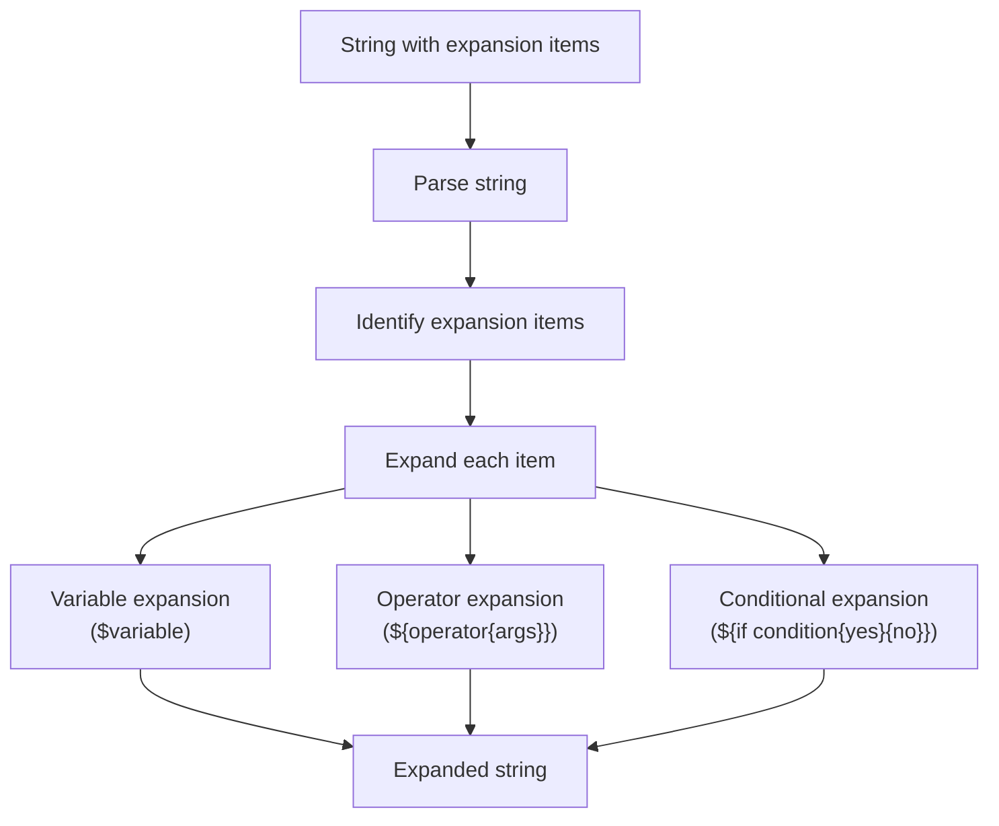
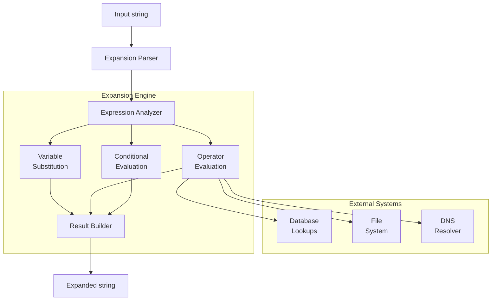
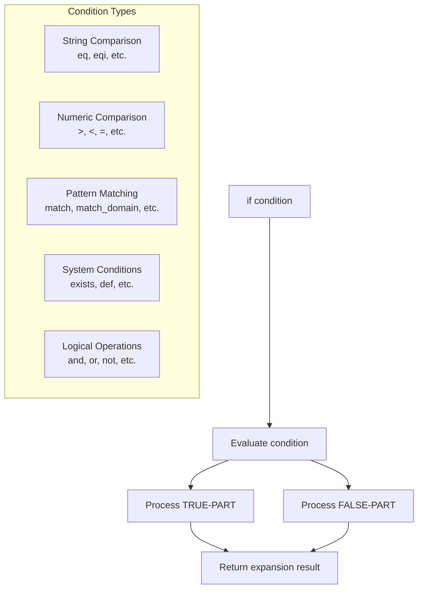
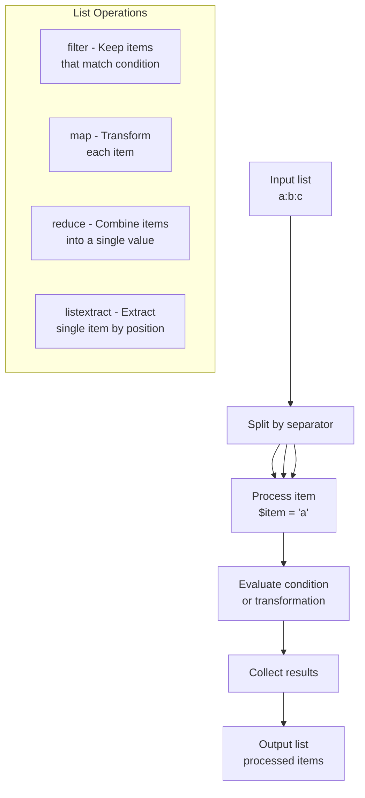

# String Expansion

> **Relevant source files**
> * [doc/doc-docbook/spec.xfpt](https://github.com/Exim/exim/blob/29568b25/doc/doc-docbook/spec.xfpt)
> * [doc/doc-txt/ChangeLog](https://github.com/Exim/exim/blob/29568b25/doc/doc-txt/ChangeLog)
> * [doc/doc-txt/NewStuff](https://github.com/Exim/exim/blob/29568b25/doc/doc-txt/NewStuff)
> * [doc/doc-txt/OptionLists.txt](https://github.com/Exim/exim/blob/29568b25/doc/doc-txt/OptionLists.txt)
> * [src/src/acl.c](https://github.com/Exim/exim/blob/29568b25/src/src/acl.c)
> * [src/src/daemon.c](https://github.com/Exim/exim/blob/29568b25/src/src/daemon.c)
> * [src/src/deliver.c](https://github.com/Exim/exim/blob/29568b25/src/src/deliver.c)
> * [src/src/exim.c](https://github.com/Exim/exim/blob/29568b25/src/src/exim.c)
> * [src/src/expand.c](https://github.com/Exim/exim/blob/29568b25/src/src/expand.c)
> * [src/src/functions.h](https://github.com/Exim/exim/blob/29568b25/src/src/functions.h)
> * [src/src/globals.c](https://github.com/Exim/exim/blob/29568b25/src/src/globals.c)
> * [src/src/globals.h](https://github.com/Exim/exim/blob/29568b25/src/src/globals.h)
> * [src/src/readconf.c](https://github.com/Exim/exim/blob/29568b25/src/src/readconf.c)
> * [src/src/receive.c](https://github.com/Exim/exim/blob/29568b25/src/src/receive.c)
> * [src/src/smtp_in.c](https://github.com/Exim/exim/blob/29568b25/src/src/smtp_in.c)
> * [src/src/structs.h](https://github.com/Exim/exim/blob/29568b25/src/src/structs.h)
> * [src/src/transport.c](https://github.com/Exim/exim/blob/29568b25/src/src/transport.c)
> * [src/src/transports/smtp.c](https://github.com/Exim/exim/blob/29568b25/src/src/transports/smtp.c)
> * [src/src/verify.c](https://github.com/Exim/exim/blob/29568b25/src/src/verify.c)
> * [test/scripts/0000-Basic/0002](https://github.com/Exim/exim/blob/29568b25/test/scripts/0000-Basic/0002)
> * [test/stderr/0002](https://github.com/Exim/exim/blob/29568b25/test/stderr/0002)
> * [test/stderr/0092](https://github.com/Exim/exim/blob/29568b25/test/stderr/0092)
> * [test/stderr/0388](https://github.com/Exim/exim/blob/29568b25/test/stderr/0388)
> * [test/stderr/0398](https://github.com/Exim/exim/blob/29568b25/test/stderr/0398)
> * [test/stderr/0402](https://github.com/Exim/exim/blob/29568b25/test/stderr/0402)
> * [test/stderr/0432](https://github.com/Exim/exim/blob/29568b25/test/stderr/0432)
> * [test/stderr/0544](https://github.com/Exim/exim/blob/29568b25/test/stderr/0544)
> * [test/stderr/0620](https://github.com/Exim/exim/blob/29568b25/test/stderr/0620)
> * [test/stderr/0628](https://github.com/Exim/exim/blob/29568b25/test/stderr/0628)
> * [test/stderr/0632](https://github.com/Exim/exim/blob/29568b25/test/stderr/0632)
> * [test/stderr/3000](https://github.com/Exim/exim/blob/29568b25/test/stderr/3000)
> * [test/stderr/5403](https://github.com/Exim/exim/blob/29568b25/test/stderr/5403)
> * [test/stderr/5410](https://github.com/Exim/exim/blob/29568b25/test/stderr/5410)
> * [test/stderr/5420](https://github.com/Exim/exim/blob/29568b25/test/stderr/5420)
> * [test/stderr/5840](https://github.com/Exim/exim/blob/29568b25/test/stderr/5840)
> * [test/stdout/0002](https://github.com/Exim/exim/blob/29568b25/test/stdout/0002)

String expansion is a powerful mechanism in Exim that allows for dynamic evaluation and transformation of text strings at runtime. This feature is central to Exim's flexibility, enabling complex configurations with conditional logic, variable substitution, and text manipulation. String expansion is used throughout Exim in configuration files, headers, and various control structures.

For information about specific ACL (Access Control List) testing within string expansion, see [String Expansion and ACL Testing](/Exim/exim/7.2-test-examples-and-patterns).

## Overview of String Expansion

String expansion in Exim occurs whenever a string is prefixed with a dollar sign (`$`) to reference a variable, or enclosed in `${...}` to invoke a more complex operation. The expansion mechanism evaluates these expressions and replaces them with their computed results.



Sources: [src/src/string.c L1320-L1365](https://github.com/Exim/exim/blob/29568b25/src/src/string.c#L1320-L1365)

 [test/stdout/0002 L8-L34](https://github.com/Exim/exim/blob/29568b25/test/stdout/0002#L8-L34)

## Basic Syntax

### Variable References

The simplest form of expansion is a variable reference:

```
$variable_name or ${variable_name}
```

Exim provides numerous predefined variables such as `$primary_hostname`, `$local_part`, `$domain`, etc.

### Operator Calls

More complex operations use the form:

```
${operator{argument1}{argument2}...}
```

For example:

* `${substr{1}{3}{abcdef}}` extracts characters from position 1 with length 3 from "abcdef"
* `${hash{8}{string}}` computes an 8-bit hash of "string"

### Conditional Expressions

Conditions use the form:

```
${if condition{value-if-true}{value-if-false}}
```

For example:

* `${if eq{a}{b}{yes}{no}}` results in "no" since "a" is not equal to "b"

Sources: [test/stdout/0002 L385-L426](https://github.com/Exim/exim/blob/29568b25/test/stdout/0002#L385-L426)

 [test/scripts/0000-Basic/0002 L391-L426](https://github.com/Exim/exim/blob/29568b25/test/scripts/0000-Basic/0002#L391-L426)

## Variables

String expansion provides access to numerous variables containing information about the current message, server environment, and configuration.

Here's a table of commonly used variables:

| Variable | Description |
| --- | --- |
| `$primary_hostname` | The primary hostname of the Exim server |
| `$local_part` | The local part of an email address |
| `$domain` | The domain part of an email address |
| `$sender_address` | The sender's email address |
| `$message_id` | The unique message ID |
| `$tod_full` | The current date and time in full format |
| `$message_headers` | All message headers |
| `$header_*` | Individual header fields (e.g., `$header_subject`) |
| `$acl_c*`, `$acl_m*` | ACL variables for storing values during processing |

Sources: [test/stdout/0002 L8-L24](https://github.com/Exim/exim/blob/29568b25/test/stdout/0002#L8-L24)

 [test/scripts/0000-Basic/0002 L16-L31](https://github.com/Exim/exim/blob/29568b25/test/scripts/0000-Basic/0002#L16-L31)

## Expansion Process



Sources: [src/src/string.c L1319-L1365](https://github.com/Exim/exim/blob/29568b25/src/src/string.c#L1319-L1365)

 [test/stderr/0002 L11-L117](https://github.com/Exim/exim/blob/29568b25/test/stderr/0002#L11-L117)

## Operators

Exim provides a rich set of operators for string manipulation, mathematical calculations, and various other operations.

### String Manipulation Operators

| Operator | Description | Example |
| --- | --- | --- |
| `length` | Returns the length of a string | `${length{abcdef}}` → 6 |
| `substr` | Extracts a substring | `${substr{2}{3}{abcdef}}` → "cde" |
| `lc` | Converts to lowercase | `${lc{AbCd}}` → "abcd" |
| `uc` | Converts to uppercase | `${uc{AbCd}}` → "ABCD" |
| `quote` | Quotes a string | `${quote{a b}}` → ""a b"" |
| `escape` | Escapes non-printing characters | `${escape{tab\t}}` → "tab\t" |

### Mathematical Operators

| Operator | Description | Example |
| --- | --- | --- |
| `eval` | Evaluates a mathematical expression | `${eval:1+2*3}` → 7 |
| `eval10` | Base-10 evaluation | `${eval10:077}` → 77 |
| `base32` | Converts to base32 | `${base32:42}` → "bk" |
| `base62` | Converts to base62 | `${base62:12345}` → "0003D7" or "0009IX" |

### Cryptographic and Hashing Operators

| Operator | Description | Example |
| --- | --- | --- |
| `hash` | Computes a hash value | `${hash{5}{string}}` → hash value |
| `md5` | Computes MD5 hash | `${md5:string}` → MD5 hash |
| `sha1` | Computes SHA1 hash | `${sha1:string}` → SHA1 hash |
| `hmac` | Computes HMAC | `${hmac{md5}{key}{data}}` → HMAC value |

### Network and Address Operators

| Operator | Description | Example |
| --- | --- | --- |
| `address` | Extracts address part | `${address:Exim <user@domain>}` → "user@domain" |
| `domain` | Extracts domain part | `${domain:user@domain.com}` → "domain.com" |
| `local_part` | Extracts local part | `${local_part:user@domain.com}` → "user" |
| `mask` | Applies network mask | `${mask:192.168.10.206/28}` → "192.168.10.192/28" |

Sources: [test/stdout/0002 L166-L316](https://github.com/Exim/exim/blob/29568b25/test/stdout/0002#L166-L316)

 [test/scripts/0000-Basic/0002 L166-L316](https://github.com/Exim/exim/blob/29568b25/test/scripts/0000-Basic/0002#L166-L316)

## Conditional Expansion

Conditional expansion allows for executing different expansions based on specified conditions. The basic syntax is:

```
${if CONDITION {TRUE-PART} {FALSE-PART}}
```

### Condition Types

1. **String Comparison**: * `eq` - Equal (case-sensitive) * `eqi` - Equal (case-insensitive) * `lt` - Less than (case-sensitive) * `lti` - Less than (case-insensitive)
2. **Numeric Comparison**: * `>` - Greater than * `>=` - Greater than or equal to * `<` - Less than * `<=` - Less than or equal to * `=` - Equal (numeric)
3. **Pattern Matching**: * `match` - Regular expression match * `match_address` - Address pattern match * `match_domain` - Domain pattern match * `match_ip` - IP address match * `match_local_part` - Local part match
4. **System Conditions**: * `exists` - File existence check * `def` - Variable definition check * `isip` - IP address format check * `isip4` - IPv4 address format check * `isip6` - IPv6 address format check
5. **Logical Operators**: * `and` - Logical AND * `or` - Logical OR * `!` - Logical NOT (negation)



Sources: [test/stdout/0002 L385-L519](https://github.com/Exim/exim/blob/29568b25/test/stdout/0002#L385-L519)

 [test/scripts/0000-Basic/0002 L377-L519](https://github.com/Exim/exim/blob/29568b25/test/scripts/0000-Basic/0002#L377-L519)

## List Operations

Exim provides powerful operations for working with lists. Lists are typically represented as colon-separated strings (e.g., "a:b:c"), but the separator can be specified using a special syntax.

### List Operators

| Operator | Description | Example |
| --- | --- | --- |
| `filter` | Filters list items based on a condition | `${filter{a:b:c}{!eq{$item}{b}}}` → "a:c" |
| `map` | Applies expansion to each item | `${map{a:b:c}{[$item]}}` → "[a]:[b]:[c]" |
| `reduce` | Reduces list to a single value | `${reduce{1:2:3}{0}{${eval:$value+$item}}}` → "6" |
| `listcount` | Counts items in a list | `${listcount:a:b:c}` → "3" |
| `listextract` | Extracts item at position | `${listextract{2}{a:b:c:d}}` → "b" |
| `listquote` | Quotes list items containing separator | `${listquote{:}{ab:cd}}` → "ab::cd" |
| `sort` | Sorts a list | `${sort{3:2:1:4}{<}{$item}}` → "1:2:3:4" |

### List Item Processing

When processing list items, Exim makes the following variables available:

* `$item` - The current list item
* `$value` - The accumulated value (for reduce operations)



Sources: [test/stdout/0002 L77-L146](https://github.com/Exim/exim/blob/29568b25/test/stdout/0002#L77-L146)

 [test/scripts/0000-Basic/0002 L86-L146](https://github.com/Exim/exim/blob/29568b25/test/scripts/0000-Basic/0002#L86-L146)

## Lookup Operations

Exim provides lookup operators that perform queries against various data sources. The general syntax is:

```
${lookup{key}type{file/database}{result-if-successful}{result-if-failed}}
```

### Common Lookup Types

| Type | Description |
| --- | --- |
| `lsearch` | Linear search in a file |
| `dbm` | DBM database lookup |
| `cdb` | Constant database lookup |
| `dsearch` | Directory search |
| `mysql` | MySQL database query |
| `pgsql` | PostgreSQL database query |
| `ldap` | LDAP directory query |
| `iplsearch` | IP address search |
| `dnsdb` | DNS database lookup |

### Nested Lookups

Lookups can be nested to perform complex operations:

```
${lookup{${lookup{key1}type1{file1}}type2{file2}}
```

This first looks up "key1" in "file1" using "type1", then uses the result as a key for a second lookup in "file2" using "type2".

Sources: [test/stdout/0002 L538-L669](https://github.com/Exim/exim/blob/29568b25/test/stdout/0002#L538-L669)

 [test/scripts/0000-Basic/0002 L555-L669](https://github.com/Exim/exim/blob/29568b25/test/scripts/0000-Basic/0002#L555-L669)

## Security Concerns

### Taint Checking

Exim implements taint checking to prevent potentially malicious string expansions. When a string comes from an external source (like email headers), it is marked as "tainted". Certain operations refuse to work with tainted strings to maintain security.

Example of a taint checking error:

```yaml
Failed: internal expansion of "sndr@dom" failed: attempt to expand tainted string 'sndr@dom'
```

### Safe Operations

Some operations are designed to be safe to use with tainted strings, such as:

* Simple variable references
* Basic string formatting
* Controlled pattern matching

Sources: [test/stderr/0002 L173-L180](https://github.com/Exim/exim/blob/29568b25/test/stderr/0002#L173-L180)

 [test/stdout/0002 L966-L983](https://github.com/Exim/exim/blob/29568b25/test/stdout/0002#L966-L983)

## Advanced Usage

### Call Command

The `${run{command}}` operator executes an external command and returns its output. This is powerful but potentially dangerous, so it's restricted by default.

### File Insertion

The `${readfile{file}}` operator reads the contents of a file into the expansion.

### Perl Integration

If Exim is compiled with Perl support, the `${perl{sub}{args}}` operator allows calling Perl subroutines.

### Error Handling

Expansion errors can be handled with:

* Logging errors using `${logwrite{message}}`
* Forcing failure with `fail` or `fail_forced`
* Using default values for potentially failing operations

Sources: [test/stdout/0002 L796-L826](https://github.com/Exim/exim/blob/29568b25/test/stdout/0002#L796-L826)

 [test/stderr/3000 L24-L48](https://github.com/Exim/exim/blob/29568b25/test/stderr/3000#L24-L48)

## Common Expansion Patterns

### Conditional Configuration

```
transport = ${if eq {$local_part}{postmaster} {local_delivery} {remote_delivery}}
```

### Smart Routing

```
route_list = ${if match_domain{$domain}{example.com} {example-server:} {default-server:}}
```

### Dynamic Headers

```
headers_add = X-Processed-By: ${primary_hostname} at ${tod_full}
```

### Address Manipulation

```
redirect_address = ${if match{$local_part}{^(.+)\.admin$} {$1@admin.example.com} {$local_part@example.com}}
```

Sources: [test/stderr/0402 L41-L76](https://github.com/Exim/exim/blob/29568b25/test/stderr/0402#L41-L76)

 [test/stderr/0388 L73-L82](https://github.com/Exim/exim/blob/29568b25/test/stderr/0388#L73-L82)

## Debugging String Expansions

Expansion debugging can be enabled with the `-d` command-line option. The debug output shows the full expansion process, including:

1. Expansion item identification
2. Variable value resolution
3. Condition evaluation
4. Result computation

Example debug output:

```yaml
╭considering: ${if eq{1}{1}{yes}{no}}
 cond: eq
  ╭considering: 1}{1}{yes}{no}}
  ├───────text: 1
  ├considering: }{1}{yes}{no}}
  ├───expanded: 1
  ╰─────result: 1
  ...
├──condition: eq {1}{1}
├─────result: true
```

Sources: [test/stderr/0002 L1-L117](https://github.com/Exim/exim/blob/29568b25/test/stderr/0002#L1-L117)

 [test/stderr/5410 L17-L72](https://github.com/Exim/exim/blob/29568b25/test/stderr/5410#L17-L72)

## Performance Considerations

1. Complex expansions can impact performance, especially when used in critical paths
2. Nested conditions and lookups are particularly resource-intensive
3. For frequently executed expansions, consider: * Minimizing lookup operations * Reducing nested conditions * Using simpler operations when possible

Sources: [src/src/string.c L1173-L1212](https://github.com/Exim/exim/blob/29568b25/src/src/string.c#L1173-L1212)