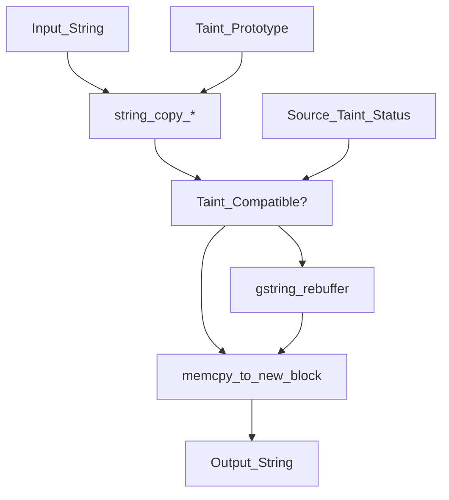
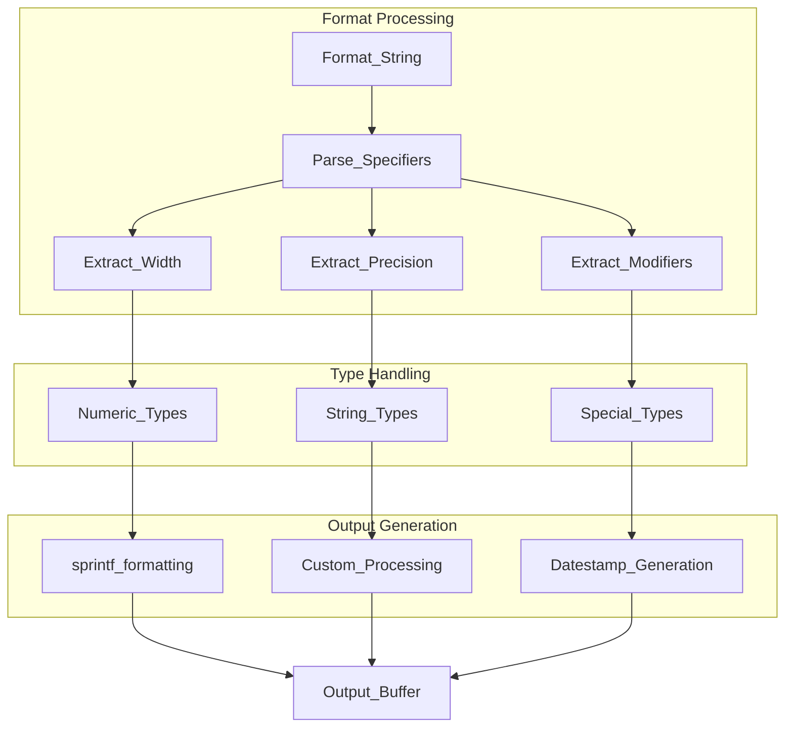
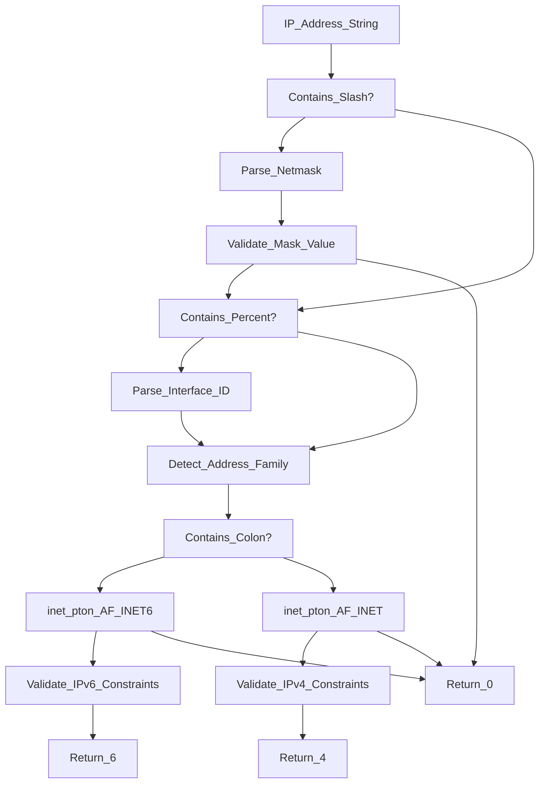
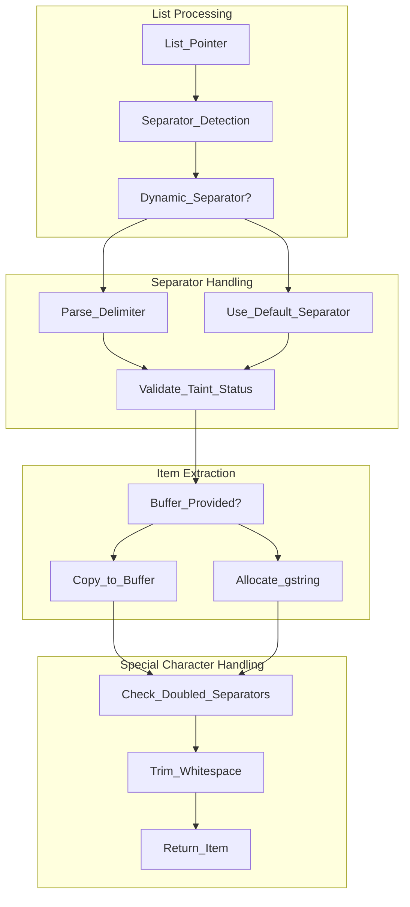
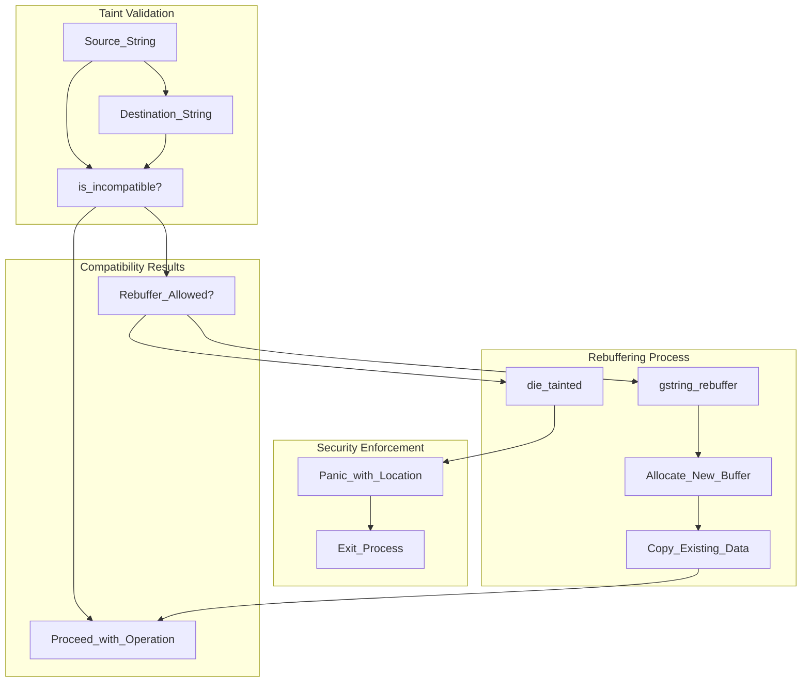

# String Handling

> **Relevant source files**
> * [src/src/macros.h](https://github.com/Exim/exim/blob/29568b25/src/src/macros.h)
> * [src/src/string.c](https://github.com/Exim/exim/blob/29568b25/src/src/string.c)

This document covers Exim's comprehensive string processing utilities, character handling functions, and formatting mechanisms. These foundational components provide safe, efficient string manipulation capabilities throughout the mail processing pipeline.

For information about string expansion (variable substitution and expression evaluation), see [String Expansion](/Exim/exim/2.5-string-expansion). For memory management details, see [Memory Management](/Exim/exim/5.2-memory-management).

## Purpose and Scope

Exim's string handling system provides:

* **Safe String Manipulation**: Functions for copying, concatenating, and modifying strings with taint tracking
* **Character Validation**: Utilities for validating IP addresses, email addresses, and character sets
* **Format Conversion**: Base62 encoding, size formatting, and escape sequence processing
* **String Building**: Growable string (`gstring`) infrastructure for efficient string construction
* **List Processing**: Functions for parsing and manipulating separated lists
* **Security Features**: Taint tracking and validation to prevent security vulnerabilities

## String Handling Architecture

```

```

**Sources:** [src/src/string.c L1-L2092](https://github.com/Exim/exim/blob/29568b25/src/src/string.c#L1-L2092)

 [src/src/macros.h L1-L1234](https://github.com/Exim/exim/blob/29568b25/src/src/macros.h#L1-L1234)

## Core String Functions

### String Copying and Memory Management

The string copying functions handle memory allocation and taint tracking:

| Function | Purpose | Taint Handling |
| --- | --- | --- |
| `string_copy_function()` | Copy string with same taint status | Preserves taint |
| `string_copy_taint_function()` | Copy with explicit taint status | Explicit control |
| `string_copy_malloc()` | Copy to malloc'd memory | No taint tracking |
| `string_copy_dnsdomain()` | Copy DNS domain with unescaping | Always tainted |



**Sources:** [src/src/string.c L466-L522](https://github.com/Exim/exim/blob/29568b25/src/src/string.c#L466-L522)

### Growable String Infrastructure

The `gstring` structure enables efficient string building:

```

```

**Sources:** [src/src/string.c L1173-L1315](https://github.com/Exim/exim/blob/29568b25/src/src/string.c#L1173-L1315)

## String Formatting and Printing

### Format String Processing

The `string_vformat_trc()` function provides printf-style formatting with Exim-specific extensions:

| Format | Description | Example |
| --- | --- | --- |
| `%D` | Daily datestamp | `20240315` |
| `%M` | Monthly datestamp | `202403` |
| `%S` | Lowercase string | `hello` |
| `%T` | Uppercase string | `HELLO` |
| `%Y` | gstring pointer | Variable content |
| `%b` | blob pointer | Binary data |
| `%H` | Hex print with precision | `48656c6c6f` |
| `%Z` | Quote-print format | `{SP}Hello{LF}` |



**Sources:** [src/src/string.c L1399-L1873](https://github.com/Exim/exim/blob/29568b25/src/src/string.c#L1399-L1873)

## Character Handling and Validation

### Character Classification Macros

Exim defines custom character classification macros for consistent behavior across platforms:

```

```

**Sources:** [src/src/macros.h L71-L83](https://github.com/Exim/exim/blob/29568b25/src/src/macros.h#L71-L83)

### IP Address Validation

The `string_is_ip_addressX()` function validates IPv4 and IPv6 addresses:



**Sources:** [src/src/string.c L44-L166](https://github.com/Exim/exim/blob/29568b25/src/src/string.c#L44-L166)

## List Processing Functions

### Separated List Parsing

The `string_nextinlist_trc()` function parses separated lists with dynamic separator detection:



**Sources:** [src/src/string.c L913-L1018](https://github.com/Exim/exim/blob/29568b25/src/src/string.c#L913-L1018)

## String Security and Taint Tracking

### Taint Compatibility Checking

String functions perform taint compatibility checks to prevent security vulnerabilities:



**Sources:** [src/src/string.c L1263-L1267](https://github.com/Exim/exim/blob/29568b25/src/src/string.c#L1263-L1267)

 [src/src/string.c L1420-L1428](https://github.com/Exim/exim/blob/29568b25/src/src/string.c#L1420-L1428)

## Utility Functions

### Escape Sequence Processing

The `string_interpret_escape()` function handles C-style escape sequences:

| Escape | Description | Result |
| --- | --- | --- |
| `\n` | Newline | `0x0A` |
| `\r` | Carriage return | `0x0D` |
| `\t` | Tab | `0x09` |
| `\nnn` | Octal value | Byte value |
| `\xHH` | Hex value | Byte value |

### String Comparison Functions

Case-insensitive string comparison functions:

| Function | Purpose | Behavior |
| --- | --- | --- |
| `strcmpic()` | Compare strings | Case-insensitive |
| `strncmpic()` | Compare n characters | Case-insensitive |
| `strstric()` | Find substring | Case-insensitive search |

**Sources:** [src/src/string.c L268-L309](https://github.com/Exim/exim/blob/29568b25/src/src/string.c#L268-L309)

 [src/src/string.c L758-L852](https://github.com/Exim/exim/blob/29568b25/src/src/string.c#L758-L852)

## Integration with Core Systems

String handling integrates with Exim's core systems through:

* **Memory Management**: Uses pool-based allocation from [Memory Management](/Exim/exim/5.2-memory-management)
* **String Expansion**: Provides foundation for [String Expansion](/Exim/exim/2.5-string-expansion)
* **Logging**: Supports safe string formatting for log output
* **Configuration**: Handles configuration string processing
* **Protocol Handling**: Supports SMTP command and header processing

The string handling system ensures consistent, secure, and efficient string operations throughout Exim's mail processing pipeline.

**Sources:** [src/src/string.c L1-L2092](https://github.com/Exim/exim/blob/29568b25/src/src/string.c#L1-L2092)

 [src/src/macros.h L46-L83](https://github.com/Exim/exim/blob/29568b25/src/src/macros.h#L46-L83)