# TLS Implementation

> **Relevant source files**
> * [src/src/tls-gnu.c](https://github.com/Exim/exim/blob/29568b25/src/src/tls-gnu.c)
> * [src/src/tls-openssl.c](https://github.com/Exim/exim/blob/29568b25/src/src/tls-openssl.c)

## Purpose and Scope

This document covers Exim's Transport Layer Security (TLS) implementation, which provides encrypted communication for both SMTP client and server operations. Exim supports two TLS backends: OpenSSL and GnuTLS, with a unified interface that abstracts the underlying cryptographic library differences.

For general transport configuration, see [Transport Mechanisms](/Exim/exim/6-transport-mechanisms). For security-related ACL processing, see [Access Control Lists (ACLs)](/Exim/exim/2.4-access-control-lists-(acls)).

## Architecture Overview

Exim's TLS implementation uses a dual-backend architecture that supports both OpenSSL and GnuTLS libraries through compile-time selection. The implementation provides comprehensive TLS features including SNI, OCSP, ALPN, session resumption, and DANE verification.

### TLS Backend Selection

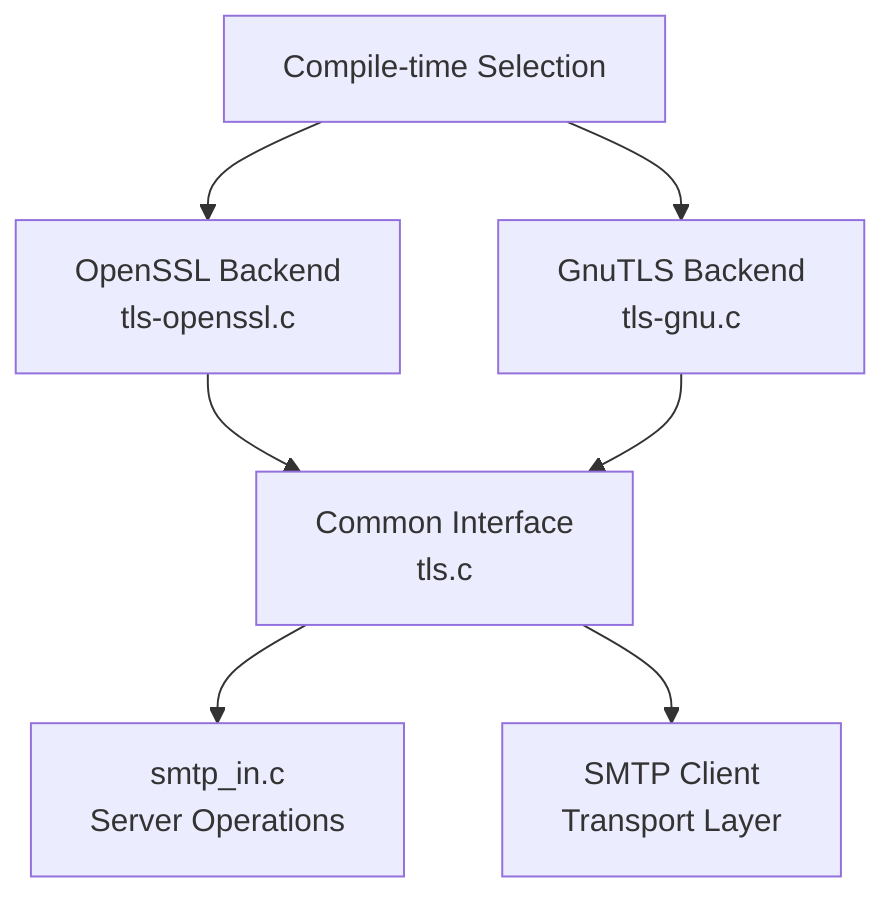

**TLS Backend Architecture**

Sources: [src/src/tls-openssl.c L1-L50](https://github.com/Exim/exim/blob/29568b25/src/src/tls-openssl.c#L1-L50)

 [src/src/tls-gnu.c L1-L50](https://github.com/Exim/exim/blob/29568b25/src/src/tls-gnu.c#L1-L50)

### State Management Structure

The TLS implementation centers around main state structures that manage session context, credentials, and configuration for both client and server operations.

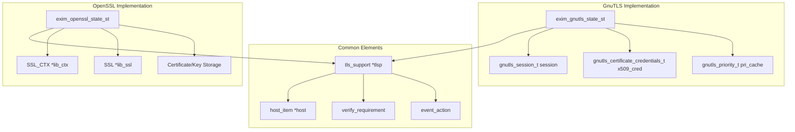

**TLS State Management Structure**

Sources: [src/src/tls-openssl.c L402-L441](https://github.com/Exim/exim/blob/29568b25/src/src/tls-openssl.c#L402-L441)

 [src/src/tls-gnu.c L200-L256](https://github.com/Exim/exim/blob/29568b25/src/src/tls-gnu.c#L200-L256)

## Initialization and Credential Management

### Server Initialization Flow

TLS server initialization involves credential preloading, certificate setup, and callback registration for various TLS extensions.

```mermaid
sequenceDiagram
  participant Daemon Process
  participant tls_server_creds_init()
  participant Certificate Loading
  participant OCSP Setup
  participant Callback Registration

  Daemon Process->>tls_server_creds_init(): Initialize server credentials
  tls_server_creds_init()->>Certificate Loading: tls_add_certfile()
  Certificate Loading->>tls_server_creds_init(): Certificate loaded
  tls_server_creds_init()->>OCSP Setup: Setup OCSP stapling
  OCSP Setup->>tls_server_creds_init(): OCSP configured
  tls_server_creds_init()->>Callback Registration: Register SNI callback
  Callback Registration->>tls_server_creds_init(): tls_servername_cb registered
  tls_server_creds_init()->>Callback Registration: Register ALPN callback
  Callback Registration->>tls_server_creds_init(): tls_server_alpn_cb registered
  tls_server_creds_init()->>Daemon Process: Server ready
```

**Server Initialization Sequence**

Sources: [src/src/tls-openssl.c L1742-L1861](https://github.com/Exim/exim/blob/29568b25/src/src/tls-openssl.c#L1742-L1861)

 [src/src/tls-gnu.c L1593-L1708](https://github.com/Exim/exim/blob/29568b25/src/src/tls-gnu.c#L1593-L1708)

### Client Initialization Flow

Client initialization supports credential preloading and transport-specific configuration, enabling efficient connection establishment.

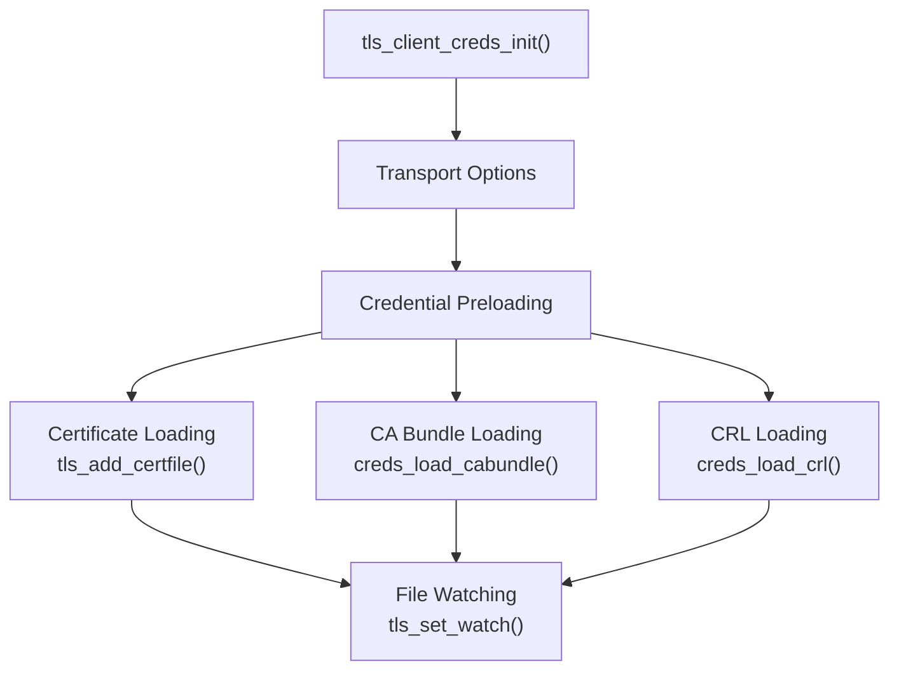

**Client Credential Initialization**

Sources: [src/src/tls-openssl.c L1871-L1941](https://github.com/Exim/exim/blob/29568b25/src/src/tls-openssl.c#L1871-L1941)

 [src/src/tls-gnu.c L1717-L1810](https://github.com/Exim/exim/blob/29568b25/src/src/tls-gnu.c#L1717-L1810)

## TLS Extensions and Features

### Server Name Indication (SNI)

SNI allows multiple SSL certificates on a single IP address by enabling certificate selection based on the requested hostname.

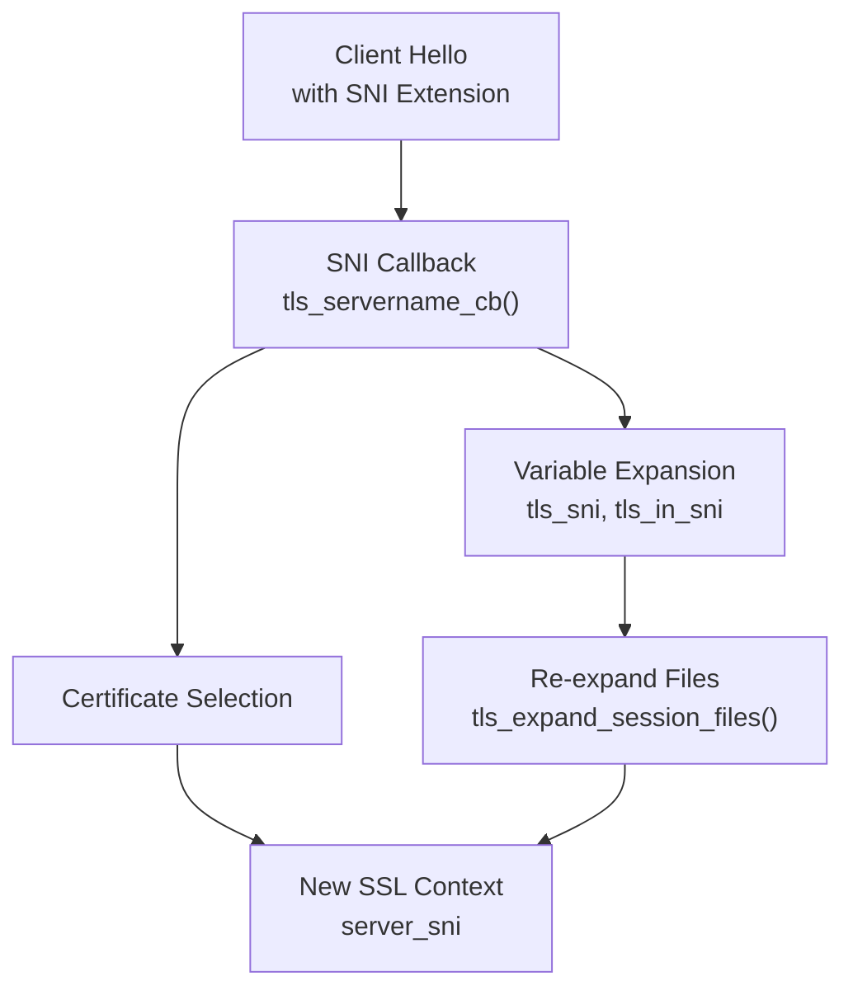

**SNI Processing Flow**

Sources: [src/src/tls-openssl.c L2216-L2302](https://github.com/Exim/exim/blob/29568b25/src/src/tls-openssl.c#L2216-L2302)

 [src/src/tls-gnu.c L2799-L2854](https://github.com/Exim/exim/blob/29568b25/src/src/tls-gnu.c#L2799-L2854)

### OCSP Stapling

Online Certificate Status Protocol (OCSP) stapling allows the server to provide certificate revocation status during the TLS handshake.

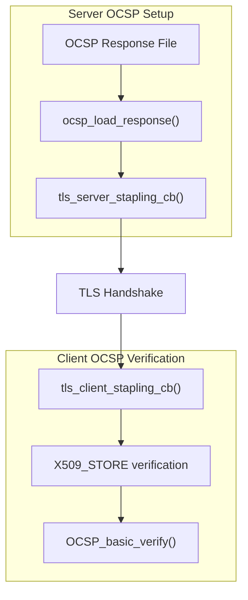

**OCSP Stapling Implementation**

Sources: [src/src/tls-openssl.c L2388-L2467](https://github.com/Exim/exim/blob/29568b25/src/src/tls-openssl.c#L2388-L2467)

 [src/src/tls-openssl.c L2488-L2795](https://github.com/Exim/exim/blob/29568b25/src/src/tls-openssl.c#L2488-L2795)

### Application Layer Protocol Negotiation (ALPN)

ALPN enables protocol negotiation during the TLS handshake, commonly used for HTTP/2 selection.

```mermaid
sequenceDiagram
  participant TLS Client
  participant TLS Server
  participant tls_server_alpn_cb()
  participant tls_alpn Configuration

  TLS Client->>TLS Server: Client Hello + ALPN Extension
  TLS Server->>tls_server_alpn_cb(): Process ALPN protocols
  tls_server_alpn_cb()->>tls_alpn Configuration: Check configured protocols
  tls_alpn Configuration->>tls_server_alpn_cb(): Return matches
  tls_server_alpn_cb()->>TLS Server: Select protocol or reject
  TLS Server->>TLS Client: Server Hello + Selected Protocol
```

**ALPN Protocol Negotiation**

Sources: [src/src/tls-openssl.c L2316-L2370](https://github.com/Exim/exim/blob/29568b25/src/src/tls-openssl.c#L2316-L2370)

 [src/src/tls-gnu.c L3054-L3076](https://github.com/Exim/exim/blob/29568b25/src/src/tls-gnu.c#L3054-L3076)

## Certificate Verification

### Verification Process

The certificate verification process supports multiple verification modes and integrates with DANE for DNS-based certificate validation.

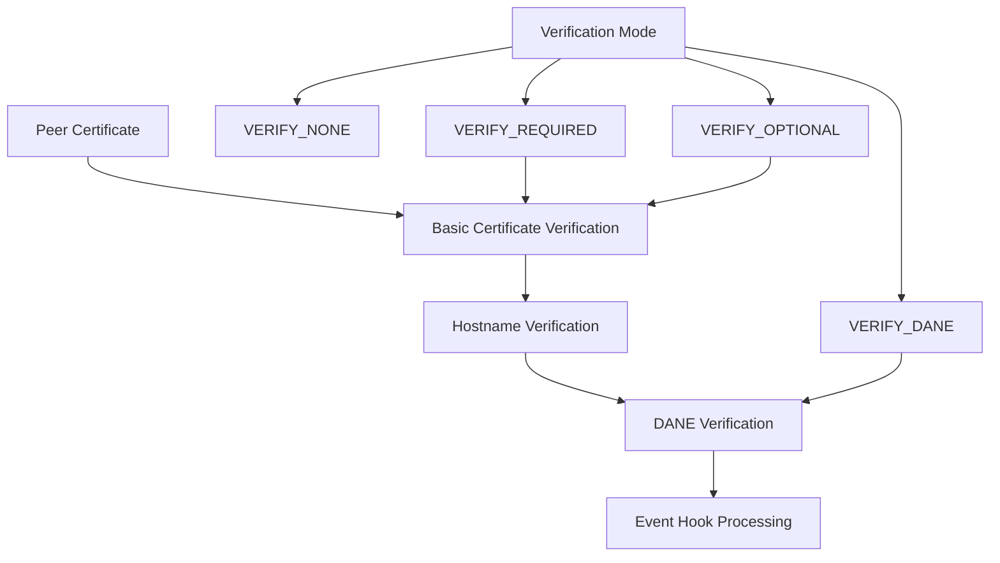

**Certificate Verification Flow**

Sources: [src/src/tls-openssl.c L1096-L1233](https://github.com/Exim/exim/blob/29568b25/src/src/tls-openssl.c#L1096-L1233)

 [src/src/tls-gnu.c L2534-L2755](https://github.com/Exim/exim/blob/29568b25/src/src/tls-gnu.c#L2534-L2755)

### DANE Support

DNS-based Authentication of Named Entities (DANE) provides certificate validation using DNS TLSA records.

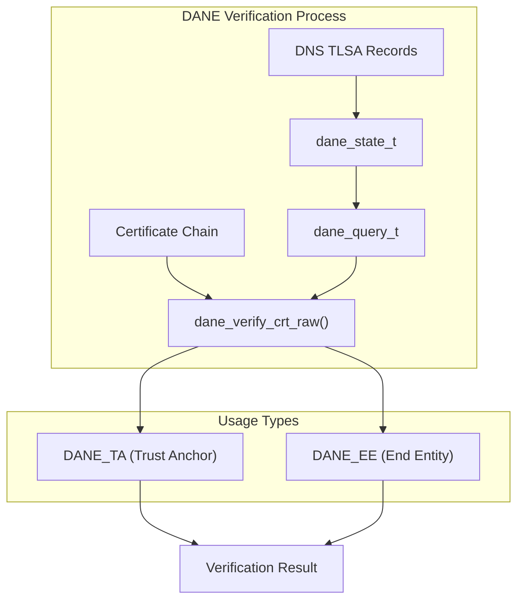

**DANE Verification Architecture**

Sources: [src/src/tls-openssl.c L1241-L1281](https://github.com/Exim/exim/blob/29568b25/src/src/tls-openssl.c#L1241-L1281)

 [src/src/tls-gnu.c L2556-L2677](https://github.com/Exim/exim/blob/29568b25/src/src/tls-gnu.c#L2556-L2677)

## Session Management and Resumption

### Session Resumption

TLS session resumption reduces handshake overhead by reusing previous session parameters.

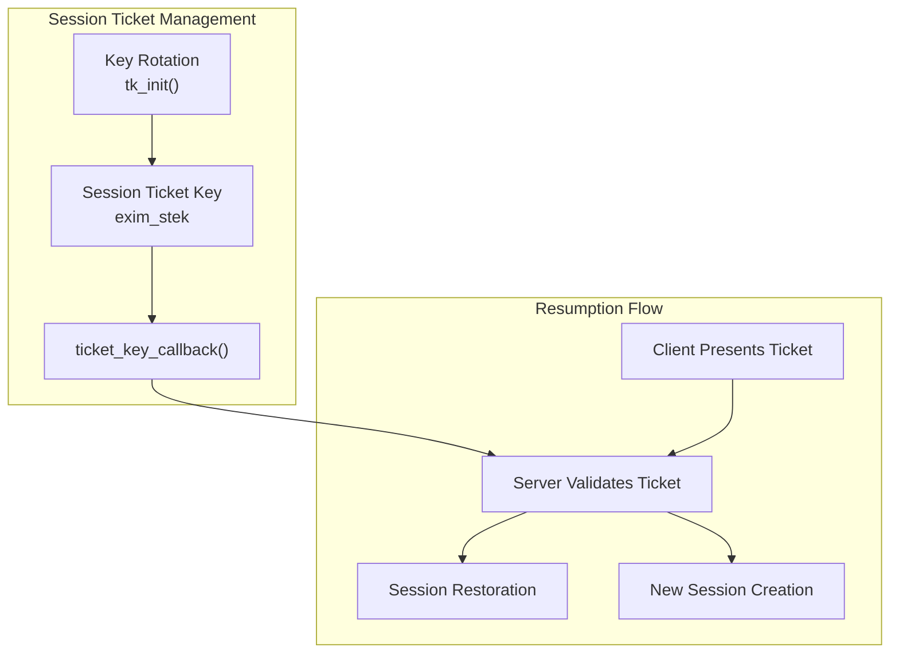

**Session Resumption Mechanism**

Sources: [src/src/tls-openssl.c L2117-L2179](https://github.com/Exim/exim/blob/29568b25/src/src/tls-openssl.c#L2117-L2179)

 [src/src/tls-gnu.c L2956-L3013](https://github.com/Exim/exim/blob/29568b25/src/src/tls-gnu.c#L2956-L3013)

## Configuration and Options

### TLS Options Processing

The TLS implementation processes various configuration options for ciphers, protocols, and security features.

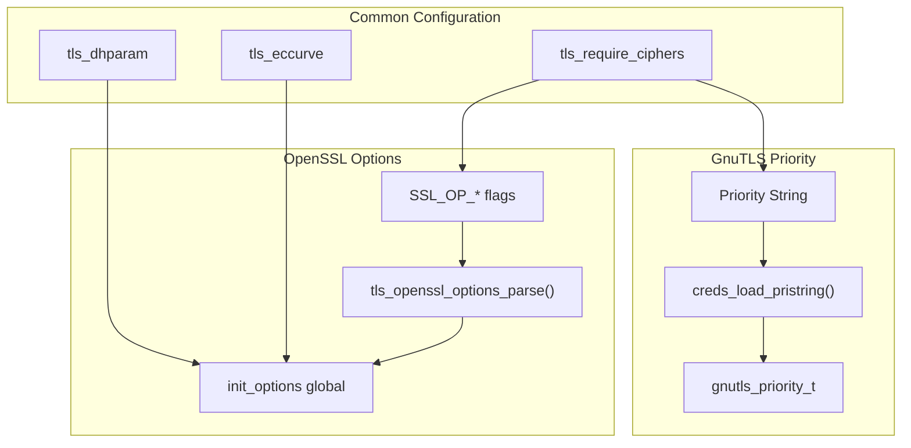

**TLS Configuration Processing**

Sources: [src/src/tls-openssl.c L175-L294](https://github.com/Exim/exim/blob/29568b25/src/src/tls-openssl.c#L175-L294)

 [src/src/tls-gnu.c L2578-L2590](https://github.com/Exim/exim/blob/29568b25/src/src/tls-gnu.c#L2578-L2590)

## Error Handling and Debugging

### Error Processing

Both TLS backends provide comprehensive error handling with detailed error reporting and debugging capabilities.

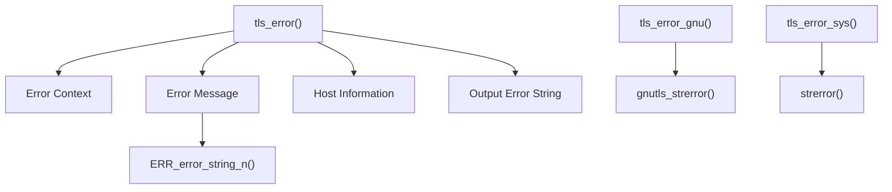

**Error Handling Framework**

Sources: [src/src/tls-openssl.c L500-L513](https://github.com/Exim/exim/blob/29568b25/src/src/tls-openssl.c#L500-L513)

 [src/src/tls-gnu.c L396-L425](https://github.com/Exim/exim/blob/29568b25/src/src/tls-gnu.c#L396-L425)

## Integration Points

The TLS implementation integrates with multiple Exim subsystems including SMTP processing, transport management, and access control systems.

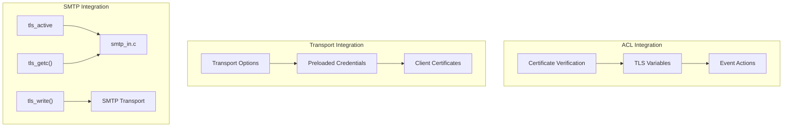

**TLS System Integration**

Sources: [src/src/tls-openssl.c L3049-L3054](https://github.com/Exim/exim/blob/29568b25/src/src/tls-openssl.c#L3049-L3054)

 [src/src/tls-gnu.c L2185-L2301](https://github.com/Exim/exim/blob/29568b25/src/src/tls-gnu.c#L2185-L2301)