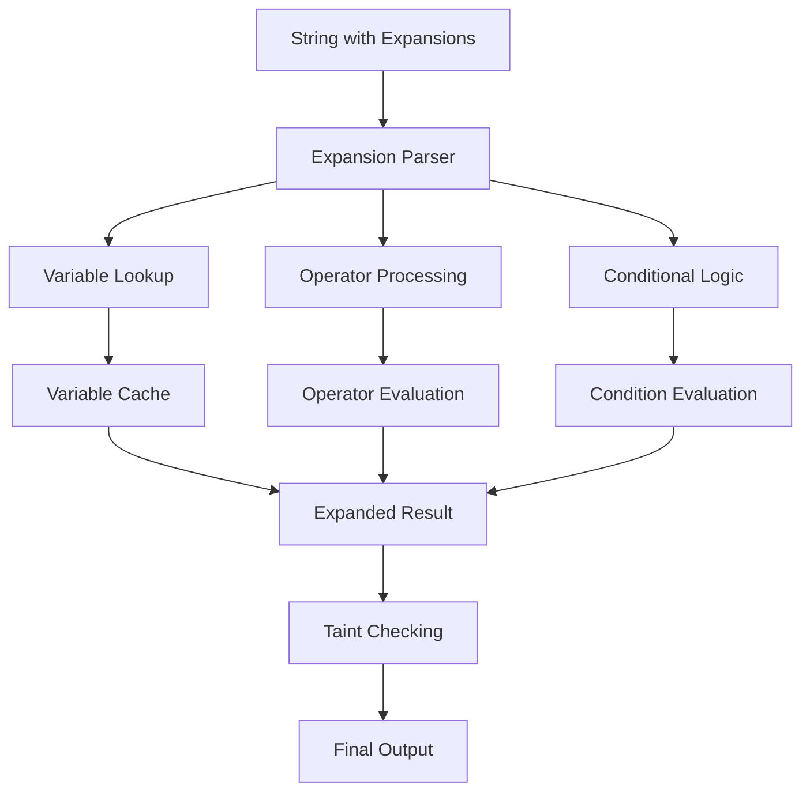
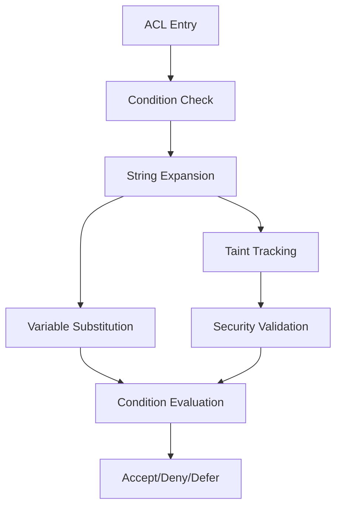
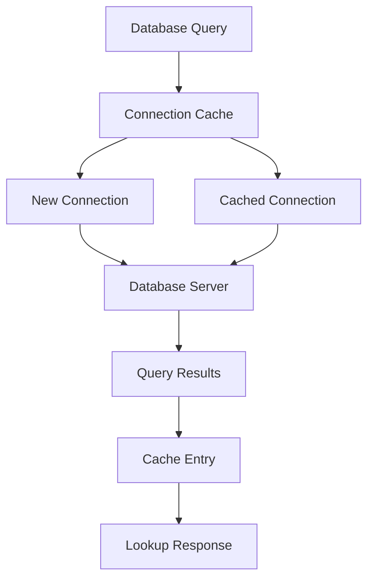
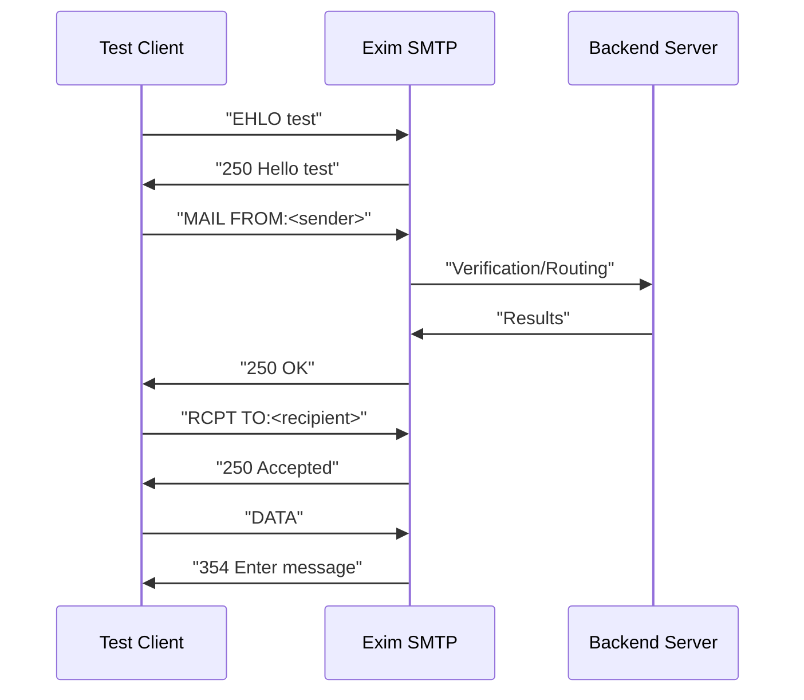

# Test Examples and Patterns

> **Relevant source files**
> * [test/scripts/0000-Basic/0002](https://github.com/Exim/exim/blob/29568b25/test/scripts/0000-Basic/0002)
> * [test/stderr/0002](https://github.com/Exim/exim/blob/29568b25/test/stderr/0002)
> * [test/stderr/0092](https://github.com/Exim/exim/blob/29568b25/test/stderr/0092)
> * [test/stderr/0275](https://github.com/Exim/exim/blob/29568b25/test/stderr/0275)
> * [test/stderr/0278](https://github.com/Exim/exim/blob/29568b25/test/stderr/0278)
> * [test/stderr/0361](https://github.com/Exim/exim/blob/29568b25/test/stderr/0361)
> * [test/stderr/0386](https://github.com/Exim/exim/blob/29568b25/test/stderr/0386)
> * [test/stderr/0388](https://github.com/Exim/exim/blob/29568b25/test/stderr/0388)
> * [test/stderr/0398](https://github.com/Exim/exim/blob/29568b25/test/stderr/0398)
> * [test/stderr/0402](https://github.com/Exim/exim/blob/29568b25/test/stderr/0402)
> * [test/stderr/0403](https://github.com/Exim/exim/blob/29568b25/test/stderr/0403)
> * [test/stderr/0408](https://github.com/Exim/exim/blob/29568b25/test/stderr/0408)
> * [test/stderr/0432](https://github.com/Exim/exim/blob/29568b25/test/stderr/0432)
> * [test/stderr/0487](https://github.com/Exim/exim/blob/29568b25/test/stderr/0487)
> * [test/stderr/0544](https://github.com/Exim/exim/blob/29568b25/test/stderr/0544)
> * [test/stderr/0620](https://github.com/Exim/exim/blob/29568b25/test/stderr/0620)
> * [test/stderr/0628](https://github.com/Exim/exim/blob/29568b25/test/stderr/0628)
> * [test/stderr/0632](https://github.com/Exim/exim/blob/29568b25/test/stderr/0632)
> * [test/stderr/2600](https://github.com/Exim/exim/blob/29568b25/test/stderr/2600)
> * [test/stderr/2610](https://github.com/Exim/exim/blob/29568b25/test/stderr/2610)
> * [test/stderr/2620](https://github.com/Exim/exim/blob/29568b25/test/stderr/2620)
> * [test/stderr/3000](https://github.com/Exim/exim/blob/29568b25/test/stderr/3000)
> * [test/stderr/5004](https://github.com/Exim/exim/blob/29568b25/test/stderr/5004)
> * [test/stderr/5005](https://github.com/Exim/exim/blob/29568b25/test/stderr/5005)
> * [test/stderr/5006](https://github.com/Exim/exim/blob/29568b25/test/stderr/5006)
> * [test/stderr/5403](https://github.com/Exim/exim/blob/29568b25/test/stderr/5403)
> * [test/stderr/5410](https://github.com/Exim/exim/blob/29568b25/test/stderr/5410)
> * [test/stderr/5420](https://github.com/Exim/exim/blob/29568b25/test/stderr/5420)
> * [test/stderr/5840](https://github.com/Exim/exim/blob/29568b25/test/stderr/5840)
> * [test/stdout/0002](https://github.com/Exim/exim/blob/29568b25/test/stdout/0002)

This document provides examples and patterns for testing Exim's functionality using the comprehensive test suite. It covers string expansion testing, ACL validation, database lookups, and protocol handling patterns.

For information about the test suite architecture and framework, see [Test Suite Architecture](/Exim/exim/7.1-test-suite-architecture). For general testing infrastructure, see [Testing Infrastructure](/Exim/exim/7-testing-infrastructure).

## String Expansion Testing Patterns

Exim's string expansion system is tested extensively through the basic test script `test/scripts/0000-Basic/0002`, which demonstrates comprehensive patterns for validating expansion functionality.

### Basic Variable and Operator Testing

The test framework validates fixed variables and basic operators through systematic patterns:

```css
# Fixed variables testing
exim_path: $exim_path
exim_version: $exim_version
config_dir: $config_dir
primary_hostname: $primary_hostname

# Mathematical operations
eval: ${eval:1+2*3}
eval: ${eval:(1+2)*3}
eval: ${eval:42}
```

The expansion engine processes these through a hierarchical evaluation system that can be traced in debug output:



Sources: [test/scripts/0000-Basic/0002 L17-L26](https://github.com/Exim/exim/blob/29568b25/test/scripts/0000-Basic/0002#L17-L26)

 [test/stdout/0002 L8-L17](https://github.com/Exim/exim/blob/29568b25/test/stdout/0002#L8-L17)

### List Operation Testing

List operations demonstrate complex data manipulation patterns:

```
filter: "${filter{a:b:c}{eq{1}{1}}}"
filter: ${filter{a:b:c}{!eq{$item}{b}}}
map: ${map{a:b:c}{:$item:}}
reduce: ${reduce{a:b:c}{+}{$value$item}}
```

These operations showcase the `$item` and `$value` variable scoping within list contexts, essential for understanding Exim's data processing capabilities.

Sources: [test/scripts/0000-Basic/0002 L88-L107](https://github.com/Exim/exim/blob/29568b25/test/scripts/0000-Basic/0002#L88-L107)

 [test/stdout/0002 L77-L97](https://github.com/Exim/exim/blob/29568b25/test/stdout/0002#L77-L97)

### Conditional and Matching Patterns

Complex conditional logic testing follows specific patterns for validation:

```css
# String matching with regex
match: ${if match{abcd}{\N^([ab]+)(\w+)$\N}{$2$1}fail}

# Address validation
match_address: ${if match_address{x@y.z}{p@q:*@y.z}{yes}{no}}

# IP address testing
isip: ${if isip{1.2.3.4}{y}{n}}
match_ip: ${if match_ip{1.2.3.4}{4.5.6.7:1.2.3.6/24}}
```

Sources: [test/scripts/0000-Basic/0002 L484-L534](https://github.com/Exim/exim/blob/29568b25/test/scripts/0000-Basic/0002#L484-L534)

 [test/stdout/0002 L478-L534](https://github.com/Exim/exim/blob/29568b25/test/stdout/0002#L478-L534)

## ACL Testing and Validation

ACL (Access Control List) testing patterns demonstrate policy enforcement validation through systematic approaches.

### ACL Expansion Tracing

The debug output shows detailed ACL processing with expansion tracing:



Example ACL processing trace from debug output:

```
using ACL "cutthrough"
processing ACL cutthrough "accept" (TESTSUITE/test-config 22)
check control = cutthrough_delivery
check verify = recipient
```

Sources: [test/stderr/5410 L74-L107](https://github.com/Exim/exim/blob/29568b25/test/stderr/5410#L74-L107)

 [test/stderr/5420 L74-L107](https://github.com/Exim/exim/blob/29568b25/test/stderr/5420#L74-L107)

### Verification Patterns

Recipient and sender verification follows structured patterns:

```markdown
# Sender verification with callout
check verify = sender/callout=1s,maxwait=1s

# Recipient verification
check verify = recipient
```

The verification process includes routing, DNS lookups, and optional SMTP callouts, providing comprehensive address validation.

Sources: [test/stderr/0432 L15-L139](https://github.com/Exim/exim/blob/29568b25/test/stderr/0432#L15-L139)

 [test/stderr/0398 L38-L84](https://github.com/Exim/exim/blob/29568b25/test/stderr/0398#L38-L84)

## Database and Lookup Testing

Database integration testing covers multiple database backends with consistent patterns.

### Database Connection Patterns



MySQL connection testing demonstrates the pattern:

```yaml
search_open: mysql "NULL"
MYSQL new connection: host=127.0.0.1 port=PORT_N database=test user=root
creating new cache entry
lookup yielded: Philip Hazel
```

Sources: [test/stderr/2610 L9-L19](https://github.com/Exim/exim/blob/29568b25/test/stderr/2610#L9-L19)

 [test/stderr/2620 L17-L19](https://github.com/Exim/exim/blob/29568b25/test/stderr/2620#L17-L19)

### SQLite Testing Patterns

SQLite testing shows file-based database operations:

```python
${lookup sqlite {TESTSUITE/aux-fixed/sqlitedb} {select name from them where id='userx';}}
```

The lookup process includes file validation, SQL execution, and result caching.

Sources: [test/stderr/2600 L6-L15](https://github.com/Exim/exim/blob/29568b25/test/stderr/2600#L6-L15)

## Transport and Protocol Testing

Transport testing covers SMTP, local delivery, and various protocol interactions.

### SMTP Transaction Patterns

SMTP testing follows standard protocol exchange patterns:



Example SMTP transaction trace:

```
SMTP<< helo test
SMTP>> 250 myhost.test.ex Hello test [1.2.3.4]
SMTP<< mail from:<x@y>
using ACL "mail"
SMTP>> 250 OK
```

Sources: [test/stderr/0432 L54-L185](https://github.com/Exim/exim/blob/29568b25/test/stderr/0432#L54-L185)

 [test/stderr/0398 L17-L144](https://github.com/Exim/exim/blob/29568b25/test/stderr/0398#L17-L144)

### Cutthrough Delivery Testing

Cutthrough delivery testing demonstrates real-time message forwarding:

```
----------- start cutthrough setup ------------
Connecting to 127.0.0.1 [127.0.0.1]:PORT_D
SMTP>> EHLO myhost.test.ex
SMTP<< 250-myhost.test.ex Hello
SMTP>> MAIL FROM:<CALLER@myhost.test.ex>
SMTP>> RCPT TO:<userx@domain.com>
```

Sources: [test/stderr/5410 L109-L294](https://github.com/Exim/exim/blob/29568b25/test/stderr/5410#L109-L294)

## Debug Output Analysis

Debug output provides detailed tracing of Exim's internal operations.

### Expansion Tracing Format

The expansion tracing uses a hierarchical format with visual indicators:

```
╭considering: ${if eq{1}{1}{yes}{no}}
├──condition: eq {1}{1}
├─────result: true
╰─────result: yes
```

This format shows the expansion evaluation tree, making it easy to trace complex string processing.

Sources: [test/stderr/0002 L82-L117](https://github.com/Exim/exim/blob/29568b25/test/stderr/0002#L82-L117)

### Variable Taint Tracking

Taint tracking appears throughout debug output:

```
├──────value: sndr@dom
           ╰──(tainted)
```

This security feature prevents untrusted data from being used in dangerous contexts.

Sources: [test/stderr/0002 L20-L24](https://github.com/Exim/exim/blob/29568b25/test/stderr/0002#L20-L24)

 [test/stderr/5410 L92-L95](https://github.com/Exim/exim/blob/29568b25/test/stderr/5410#L92-L95)

## Common Testing Utilities

### Test Configuration Patterns

Test configurations use consistent patterns for reproducible testing:

```markdown
# Standard test setup
exim -be                    # Expansion testing mode
exim -bh <ip>              # Host testing mode
exim -bt <address>         # Address testing mode
```

### Munging and Output Normalization

The test framework includes output munging to normalize variable elements:

* Process IDs → `p1234`
* Timestamps → `Tue, 2 Mar 1999 09:44:33 +0000`
* Paths → `TESTSUITE/...`
* Network addresses → `V4NET.x.x.x`

This ensures consistent test output across different environments.

Sources: [test/stderr/0388 L4](https://github.com/Exim/exim/blob/29568b25/test/stderr/0388#L4-L4)

 [test/stderr/0432 L22](https://github.com/Exim/exim/blob/29568b25/test/stderr/0432#L22-L22)

 [test/stdout/0002 L8-L11](https://github.com/Exim/exim/blob/29568b25/test/stdout/0002#L8-L11)

### Error Testing Patterns

Error conditions are systematically tested:

```yaml
# Taint failures
Failed: attempt to use tainted string 'sndr@dom' for hash

# Expansion failures  
Failed: "if" failed and "fail" requested

# Lookup failures
Failed: lookup of "rhubarb" gave DEFER
```

These patterns ensure robust error handling and security validation.

Sources: [test/stdout/0002 L974-L975](https://github.com/Exim/exim/blob/29568b25/test/stdout/0002#L974-L975)

 [test/stdout/0002 L481](https://github.com/Exim/exim/blob/29568b25/test/stdout/0002#L481-L481)

 [test/stdout/0002 L639](https://github.com/Exim/exim/blob/29568b25/test/stdout/0002#L639-L639)