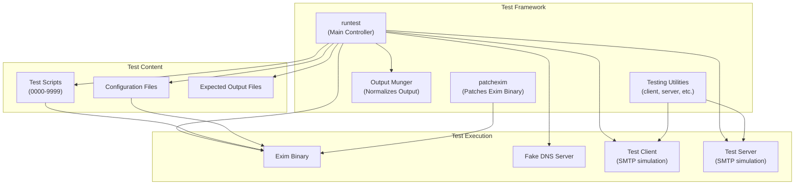
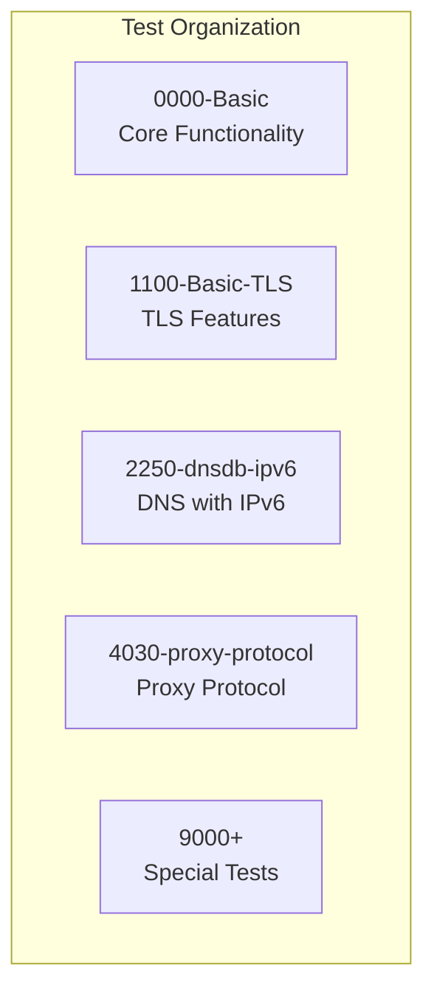
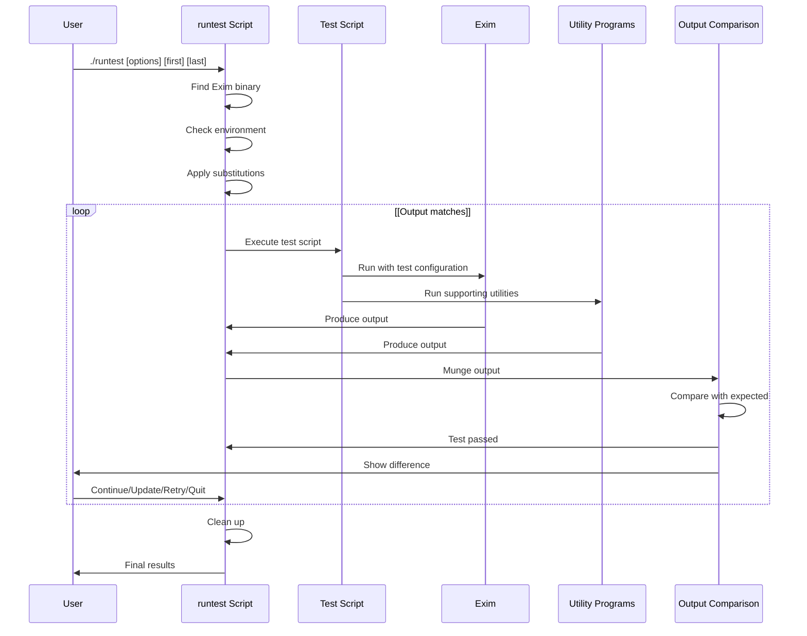
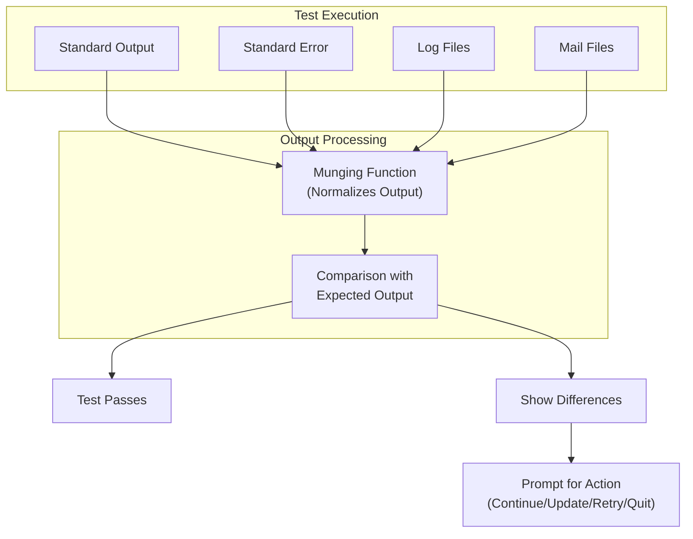

# Test Suite Architecture

> **Relevant source files**
> * [test/README](https://github.com/Exim/exim/blob/29568b25/test/README)
> * [test/confs/1101](https://github.com/Exim/exim/blob/29568b25/test/confs/1101)
> * [test/confs/4030](https://github.com/Exim/exim/blob/29568b25/test/confs/4030)
> * [test/confs/4031](https://github.com/Exim/exim/blob/29568b25/test/confs/4031)
> * [test/log/1101](https://github.com/Exim/exim/blob/29568b25/test/log/1101)
> * [test/log/4030](https://github.com/Exim/exim/blob/29568b25/test/log/4030)
> * [test/runtest](https://github.com/Exim/exim/blob/29568b25/test/runtest)
> * [test/scripts/0000-Basic/0100](https://github.com/Exim/exim/blob/29568b25/test/scripts/0000-Basic/0100)
> * [test/scripts/0000-Basic/0101](https://github.com/Exim/exim/blob/29568b25/test/scripts/0000-Basic/0101)
> * [test/scripts/0000-Basic/0242](https://github.com/Exim/exim/blob/29568b25/test/scripts/0000-Basic/0242)
> * [test/scripts/1100-Basic-TLS/1101](https://github.com/Exim/exim/blob/29568b25/test/scripts/1100-Basic-TLS/1101)
> * [test/scripts/4030-proxy-protocol/4030](https://github.com/Exim/exim/blob/29568b25/test/scripts/4030-proxy-protocol/4030)
> * [test/scripts/4030-proxy-protocol/4031](https://github.com/Exim/exim/blob/29568b25/test/scripts/4030-proxy-protocol/4031)
> * [test/scripts/4030-proxy-protocol/REQUIRES](https://github.com/Exim/exim/blob/29568b25/test/scripts/4030-proxy-protocol/REQUIRES)
> * [test/stderr/4031](https://github.com/Exim/exim/blob/29568b25/test/stderr/4031)
> * [test/stdout/1101](https://github.com/Exim/exim/blob/29568b25/test/stdout/1101)
> * [test/stdout/4030](https://github.com/Exim/exim/blob/29568b25/test/stdout/4030)
> * [test/stdout/4031](https://github.com/Exim/exim/blob/29568b25/test/stdout/4031)

This document provides an overview of Exim's test suite architecture and explains how the system works to validate Exim functionality. The test suite is designed to be exportable and run in different environments, providing comprehensive testing of Exim's features across various configurations.

## Purpose and Scope

The Exim test suite serves as an automated testing framework to verify that Exim functions correctly in different environments and with various configurations. It tests core mail processing, routing, transport mechanisms, and security features. The test suite is capable of testing both minimal Exim installations with basic features and full installations with all optional components.

The test suite has been designed to be environment-independent, handling differences in operating systems, network configurations, and Exim build options. It properly normalizes and compares test outputs to ensure consistent results across different environments.

Sources: [test/README L1-L39](https://github.com/Exim/exim/blob/29568b25/test/README#L1-L39)

 [test/runtest L8-L19](https://github.com/Exim/exim/blob/29568b25/test/runtest#L8-L19)

## Overall Architecture



Sources: [test/runtest L46-L116](https://github.com/Exim/exim/blob/29568b25/test/runtest#L46-L116)

 [test/README L505-L551](https://github.com/Exim/exim/blob/29568b25/test/README#L505-L551)

## Test Suite Components

### Main Controller (runtest)

The central component of the test suite is the `runtest` Perl script. This script:

1. Manages test execution
2. Handles command-line options
3. Finds and patches the Exim binary
4. Applies standard substitutions to configuration files
5. Executes test scripts
6. Compares actual output with expected output
7. Provides interactive error resolution
8. Cleans up after tests

The script includes a sophisticated output munging system that normalizes variable data (like timestamps, PIDs, message IDs) to ensure consistent comparisons across different environments and runs.

Sources: [test/runtest L20-L45](https://github.com/Exim/exim/blob/29568b25/test/runtest#L20-L45)

 [test/README L220-L358](https://github.com/Exim/exim/blob/29568b25/test/README#L220-L358)

### Test Scripts

Test scripts are numbered files (0000-9999) organized into subdirectories by feature area. Each script:

* Contains a descriptive header
* Defines a series of commands to execute
* Specifies requirements (if any special features are needed)
* May contain expected output for comparison

Special test scripts with numbers 9000 and above are reserved for tests requiring specific data or environment configuration that may not be generally available.



Sources: [test/README L185-L219](https://github.com/Exim/exim/blob/29568b25/test/README#L185-L219)

 [test/README L326-L340](https://github.com/Exim/exim/blob/29568b25/test/README#L326-L340)

### Test Execution Flow



Sources: [test/runtest L137-L248](https://github.com/Exim/exim/blob/29568b25/test/runtest#L137-L248)

 [test/README L359-L456](https://github.com/Exim/exim/blob/29568b25/test/README#L359-L456)

### Supporting Utilities

The test suite includes several supporting utilities:

| Utility | Purpose |
| --- | --- |
| `bin/cf` | Text comparison program for output validation |
| `bin/client` | Script-driven SMTP client simulation |
| `bin/server` | Script-driven SMTP server simulation |
| `bin/client-anytls` | TLS-enabled SMTP client (linked to SSL or GnuTLS version) |
| `bin/fakens` | Fake nameserver for DNS tests |
| `bin/checkaccess` | Checks file access permissions as Exim user |
| `patchexim` | Modifies the Exim binary for testing |

These utilities enable the test suite to simulate various network conditions, verify configurations, and validate Exim's behavior in controlled scenarios.

Sources: [test/README L505-L553](https://github.com/Exim/exim/blob/29568b25/test/README#L505-L553)

 [test/runtest L46-L116](https://github.com/Exim/exim/blob/29568b25/test/runtest#L46-L116)

## Test Script Format

Test scripts follow a specific format, combining shell-like commands with specialized directives:

```markdown
# Example test description
need_ipv4
#
exim -bd -DSERVER=server -oX PORT_D
****
client 127.0.0.1 PORT_D
??? 220
HELO clientname
??? 250
MAIL FROM:<test@example.com>
??? 250
QUIT
??? 221
****
killdaemon
```

Key elements:

* **Comments** start with `#` and include test descriptions
* **Requirements** like `need_ipv4` specify test prerequisites
* **Commands** like `exim` run the Exim binary with parameters
* **Client/server interactions** with expected responses (marked with `???`)
* **Delimiters** (`****`) separate command blocks
* **Control directives** like `killdaemon` provide flow control

Sources: [test/scripts/4030-proxy-protocol/4030 L1-L84](https://github.com/Exim/exim/blob/29568b25/test/scripts/4030-proxy-protocol/4030#L1-L84)

 [test/scripts/1100-Basic-TLS/1101 L1-L20](https://github.com/Exim/exim/blob/29568b25/test/scripts/1100-Basic-TLS/1101#L1-L20)

## Configuration System

Each test uses a dedicated Exim configuration file from the `confs` directory. The `runtest` script:

1. Copies the appropriate configuration file
2. Applies standard substitutions (hostnames, paths, ports, etc.)
3. Uses it with the `-C` command line option when running Exim

The configurations use parameterized values that are substituted at runtime to ensure portability across different environments.

Sources: [test/confs/1101 L1-L48](https://github.com/Exim/exim/blob/29568b25/test/confs/1101#L1-L48)

 [test/confs/4030 L1-L39](https://github.com/Exim/exim/blob/29568b25/test/confs/4030#L1-L39)

 [test/README L557-L590](https://github.com/Exim/exim/blob/29568b25/test/README#L557-L590)

## Output Processing and Comparison



The output comparison system:

1. Collects output from test execution (stdout, stderr, logs, mail files)
2. Processes the output through the "munging" function to standardize variable data: * Replaces timestamps with fixed values * Standardizes message IDs and PIDs * Normalizes hostnames and IP addresses * Standardizes file paths and port numbers
3. Compares the processed output with expected output files
4. Handles any differences (prompting user for action)

The munging system (`munge` function in `runtest`) is sophisticated, handling many patterns of variable data to ensure consistent comparisons.

Sources: [test/runtest L347-L975](https://github.com/Exim/exim/blob/29568b25/test/runtest#L347-L975)

 [test/README L380-L456](https://github.com/Exim/exim/blob/29568b25/test/README#L380-L456)

## Standard Substitutions

To ensure portability across different environments, the test suite applies standard substitutions to configuration files and test scripts:

| Substitution | Description |
| --- | --- |
| `CALLER` | Login name of user running tests |
| `DIR` | Test suite directory path |
| `EXIMUSER`/`EXIMGROUP` | Exim user/group name |
| `HOSTIPV4`/`HOSTIPV6` | Host IP addresses |
| `HOSTNAME` | Local hostname |
| `PORT_D`/`PORT_S`/`PORT_N` | Port numbers for daemon/server/nonexistent |
| `TESTNUM` | Current test number |
| `V4NET`/`V6NET` | Test network prefixes |

These substitutions make the test scripts and configurations environment-independent, ensuring they work correctly on different systems.

Sources: [test/runtest L151-L179](https://github.com/Exim/exim/blob/29568b25/test/runtest#L151-L179)

 [test/README L557-L606](https://github.com/Exim/exim/blob/29568b25/test/README#L557-L606)

## Test Requirements and Selection

The test suite intelligently selects tests based on:

1. The available features in the Exim binary
2. Explicit test requirements (e.g., IPv6 support, TLS support)
3. The specified range of test numbers

Tests that require features not present in the binary are automatically skipped. Tests with special requirements specify them in `REQUIRES` files or with directives like `need_ipv4`.

Sources: [test/scripts/4030-proxy-protocol/REQUIRES L1-L2](https://github.com/Exim/exim/blob/29568b25/test/scripts/4030-proxy-protocol/REQUIRES#L1-L2)

 [test/README L341-L358](https://github.com/Exim/exim/blob/29568b25/test/README#L341-L358)

## Environment Requirements

The test suite requires specific environment setup:

1. A non-root user with sudo access
2. The user must be in the Exim group
3. The Exim binary must have required minimum features
4. Required ports must be available
5. Appropriate directory permissions
6. A C compiler and Perl interpreter

The test suite verifies these requirements before running tests to ensure a proper test environment.

Sources: [test/README L42-L141](https://github.com/Exim/exim/blob/29568b25/test/README#L42-L141)

## Conclusion

The Exim test suite provides a comprehensive, portable testing framework for verifying Exim functionality across different environments and configurations. Its architecture ensures consistent results through careful output normalization, standardized test scripts, and parameterized configurations. The test suite is designed to be extensible, allowing new tests to be added as Exim evolves.

The test architecture balances thoroughness with usability, providing detailed feedback on failures and options for handling differences. This design makes it an effective tool for maintaining Exim's reliability across diverse operating environments and configurations.