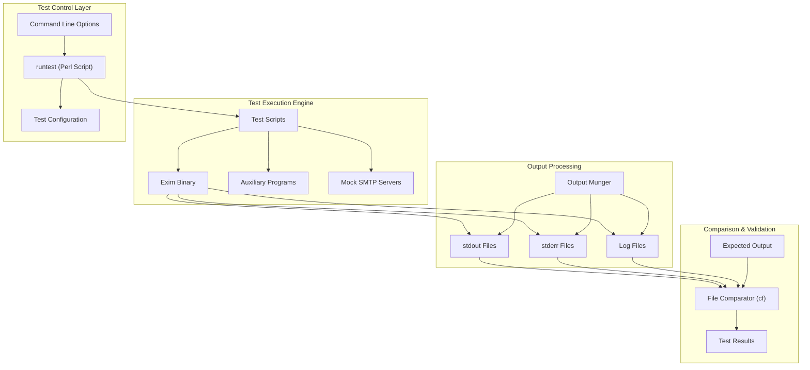
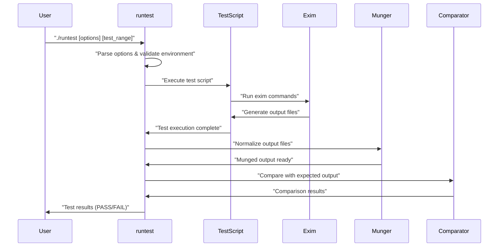
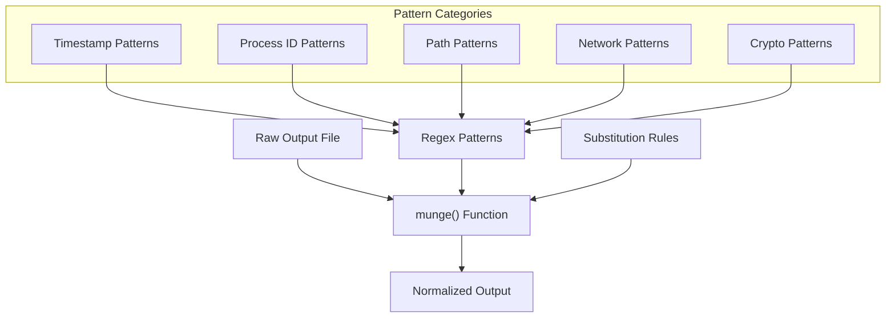
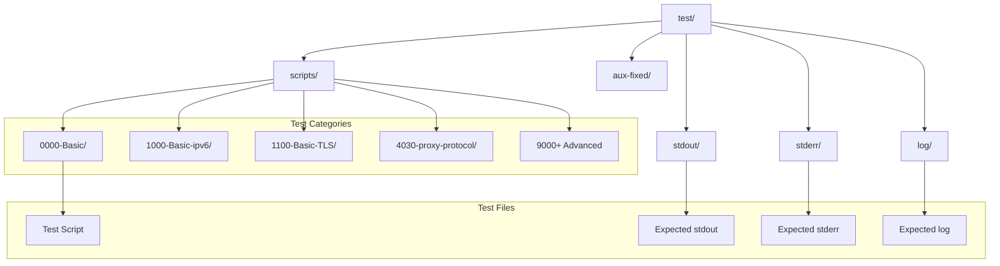
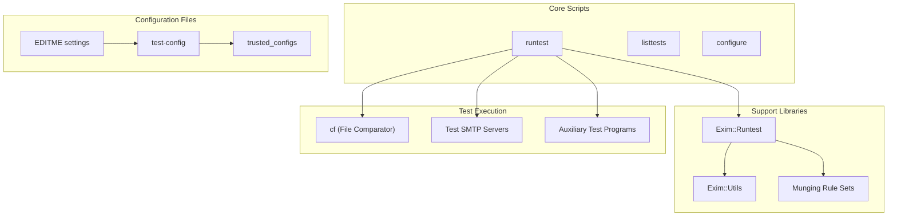
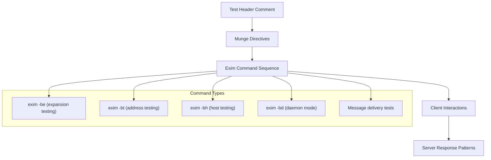
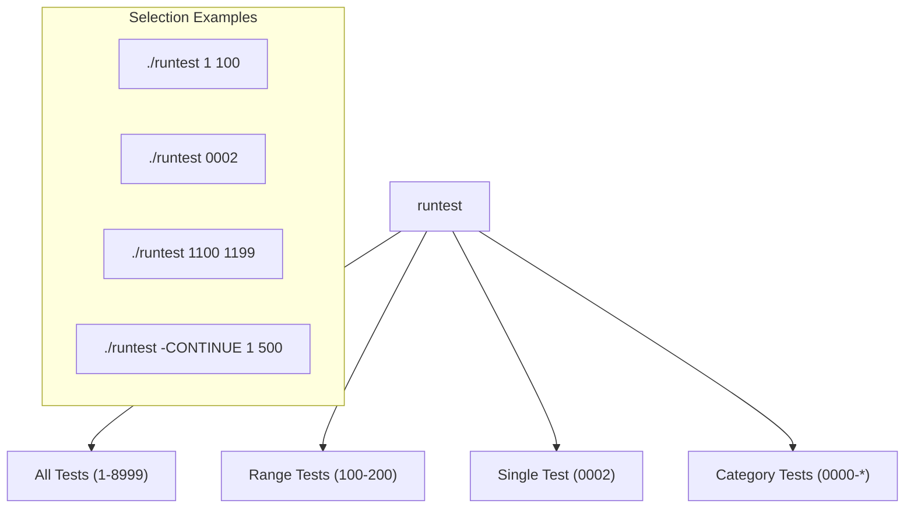

# Testing Infrastructure

> **Relevant source files**
> * [test/README](https://github.com/Exim/exim/blob/29568b25/test/README)
> * [test/confs/1101](https://github.com/Exim/exim/blob/29568b25/test/confs/1101)
> * [test/confs/4030](https://github.com/Exim/exim/blob/29568b25/test/confs/4030)
> * [test/confs/4031](https://github.com/Exim/exim/blob/29568b25/test/confs/4031)
> * [test/log/1101](https://github.com/Exim/exim/blob/29568b25/test/log/1101)
> * [test/log/4030](https://github.com/Exim/exim/blob/29568b25/test/log/4030)
> * [test/runtest](https://github.com/Exim/exim/blob/29568b25/test/runtest)
> * [test/scripts/0000-Basic/0002](https://github.com/Exim/exim/blob/29568b25/test/scripts/0000-Basic/0002)
> * [test/scripts/0000-Basic/0100](https://github.com/Exim/exim/blob/29568b25/test/scripts/0000-Basic/0100)
> * [test/scripts/0000-Basic/0101](https://github.com/Exim/exim/blob/29568b25/test/scripts/0000-Basic/0101)
> * [test/scripts/0000-Basic/0242](https://github.com/Exim/exim/blob/29568b25/test/scripts/0000-Basic/0242)
> * [test/scripts/1100-Basic-TLS/1101](https://github.com/Exim/exim/blob/29568b25/test/scripts/1100-Basic-TLS/1101)
> * [test/scripts/4030-proxy-protocol/4030](https://github.com/Exim/exim/blob/29568b25/test/scripts/4030-proxy-protocol/4030)
> * [test/scripts/4030-proxy-protocol/4031](https://github.com/Exim/exim/blob/29568b25/test/scripts/4030-proxy-protocol/4031)
> * [test/scripts/4030-proxy-protocol/REQUIRES](https://github.com/Exim/exim/blob/29568b25/test/scripts/4030-proxy-protocol/REQUIRES)
> * [test/stderr/0002](https://github.com/Exim/exim/blob/29568b25/test/stderr/0002)
> * [test/stderr/0092](https://github.com/Exim/exim/blob/29568b25/test/stderr/0092)
> * [test/stderr/0388](https://github.com/Exim/exim/blob/29568b25/test/stderr/0388)
> * [test/stderr/0398](https://github.com/Exim/exim/blob/29568b25/test/stderr/0398)
> * [test/stderr/0402](https://github.com/Exim/exim/blob/29568b25/test/stderr/0402)
> * [test/stderr/0432](https://github.com/Exim/exim/blob/29568b25/test/stderr/0432)
> * [test/stderr/0544](https://github.com/Exim/exim/blob/29568b25/test/stderr/0544)
> * [test/stderr/0620](https://github.com/Exim/exim/blob/29568b25/test/stderr/0620)
> * [test/stderr/0628](https://github.com/Exim/exim/blob/29568b25/test/stderr/0628)
> * [test/stderr/0632](https://github.com/Exim/exim/blob/29568b25/test/stderr/0632)
> * [test/stderr/3000](https://github.com/Exim/exim/blob/29568b25/test/stderr/3000)
> * [test/stderr/4031](https://github.com/Exim/exim/blob/29568b25/test/stderr/4031)
> * [test/stderr/5403](https://github.com/Exim/exim/blob/29568b25/test/stderr/5403)
> * [test/stderr/5410](https://github.com/Exim/exim/blob/29568b25/test/stderr/5410)
> * [test/stderr/5420](https://github.com/Exim/exim/blob/29568b25/test/stderr/5420)
> * [test/stderr/5840](https://github.com/Exim/exim/blob/29568b25/test/stderr/5840)
> * [test/stdout/0002](https://github.com/Exim/exim/blob/29568b25/test/stdout/0002)
> * [test/stdout/1101](https://github.com/Exim/exim/blob/29568b25/test/stdout/1101)
> * [test/stdout/4030](https://github.com/Exim/exim/blob/29568b25/test/stdout/4030)
> * [test/stdout/4031](https://github.com/Exim/exim/blob/29568b25/test/stdout/4031)

This document covers Exim's comprehensive test suite infrastructure, which provides automated testing capabilities for mail transfer functionality, protocol handling, security features, and configuration validation. The testing system is designed to be portable across different environments while maintaining deterministic results through sophisticated output normalization.

For information about build system configuration, see [Build-time Configuration](/Exim/exim/4.1-build-time-configuration). For details about specific transport testing, see [Transport Mechanisms](/Exim/exim/6-transport-mechanisms).

## Test Suite Architecture

Exim's test infrastructure is built around a central test runner that orchestrates test execution, output comparison, and result validation. The system handles the inherent variability in mail system outputs through a sophisticated "munging" process that normalizes timestamps, process IDs, and environment-specific data.



**Test Runner Core Architecture**

Sources: [test/runtest L1-L248](https://github.com/Exim/exim/blob/29568b25/test/runtest#L1-L248)

 [test/README L1-L50](https://github.com/Exim/exim/blob/29568b25/test/README#L1-L50)

## Test Execution Workflow

The test execution follows a structured workflow that ensures consistent and reproducible results across different environments. The `runtest` script manages this entire process.



**Test Execution Sequence**

The core workflow involves several key phases:

1. **Environment Setup**: Validation of Exim binary, required permissions, and test environment
2. **Test Script Execution**: Running individual test scripts that exercise specific functionality
3. **Output Munging**: Normalization of variable output elements for consistent comparison
4. **Result Comparison**: Automated comparison against expected output patterns
5. **Result Reporting**: Generation of test results and failure summaries

Sources: [test/runtest L202-L248](https://github.com/Exim/exim/blob/29568b25/test/runtest#L202-L248)

 [test/runtest L365-L422](https://github.com/Exim/exim/blob/29568b25/test/runtest#L365-L422)

## Output Normalization (Munging)

One of the most sophisticated aspects of the test infrastructure is the output munging system, which transforms variable output elements into predictable patterns for comparison.

### Munging Categories

The munging process handles several categories of variable data:

| Category | Examples | Normalization Strategy |
| --- | --- | --- |
| **Timestamps** | Log timestamps, message dates | Fixed reference dates |
| **Process IDs** | Exim daemon PIDs, child processes | Sequential numbering (`pppp`) |
| **Message IDs** | Exim message identifiers | Standardized format |
| **File Paths** | Test directory paths | Template substitutions |
| **Network Data** | IP addresses, port numbers | Placeholder values |
| **Cryptographic** | TLS certificates, keys | Normalized representations |

### Core Munging Function

The central `munge` function processes output files line by line, applying transformation rules:



**Output Munging Architecture**

Sources: [test/runtest L365-L1000](https://github.com/Exim/exim/blob/29568b25/test/runtest#L365-L1000)

 [test/runtest L252-L364](https://github.com/Exim/exim/blob/29568b25/test/runtest#L252-L364)

## Test Organization Structure

Tests are organized hierarchically by functionality and complexity, with a clear numbering scheme that groups related test cases.

### Directory Structure



**Test Directory Organization**

### Test Number Ranges

| Range | Category | Purpose |
| --- | --- | --- |
| **0000-0999** | Basic functionality | Core mail processing, routing, delivery |
| **1000-1999** | Protocol variants | IPv6, TLS, authentication methods |
| **2000-2999** | Lookups & databases | DNS, file lookups, database integrations |
| **3000-3999** | Content processing | Filters, rewriting, content scanning |
| **4000-4999** | Protocol extensions | Proxy protocol, DKIM, SPF |
| **5000-5999** | Security features | Access controls, rate limiting |
| **9000-9999** | Advanced/Special | Requires specific external data/setup |

Sources: [test/README L325-L335](https://github.com/Exim/exim/blob/29568b25/test/README#L325-L335)

 [test/scripts/0000-Basic/0002 L1-L10](https://github.com/Exim/exim/blob/29568b25/test/scripts/0000-Basic/0002#L1-L10)

## Key Test Infrastructure Components

### Primary Components

The test infrastructure consists of several key executable and configuration components:



**Test Infrastructure Components**

### Critical Files and Their Roles

| Component | File Path | Purpose |
| --- | --- | --- |
| **Test Runner** | `test/runtest` | Main test execution controller |
| **Test Discovery** | `test/listtests` | Test enumeration and filtering |
| **File Comparator** | `test/bin/cf` | Custom output comparison utility |
| **Test Library** | `test/lib/Exim/Runtest.pm` | Core test functionality |
| **Configuration** | `test/test-config` | Exim configuration for testing |
| **Build Setup** | `test/configure` | Test environment build script |

Sources: [test/runtest L1-L50](https://github.com/Exim/exim/blob/29568b25/test/runtest#L1-L50)

 [test/README L152-L170](https://github.com/Exim/exim/blob/29568b25/test/README#L152-L170)

## Test Script Format and Execution

Individual test scripts follow a standardized format that defines the test steps, expected behavior, and verification criteria.

### Test Script Structure



**Test Script Component Structure**

### Example Test Analysis

Looking at test 0002 (Common string expansions), the structure demonstrates typical patterns:

* **Header**: Descriptive comment explaining test purpose
* **Munge directive**: `munge dnssec` to normalize DNSSEC-related output
* **Command sequence**: `exim -be` for expansion testing
* **Test data**: Various expansion expressions and expected results

Sources: [test/scripts/0000-Basic/0002 L1-L50](https://github.com/Exim/exim/blob/29568b25/test/scripts/0000-Basic/0002#L1-L50)

 [test/stdout/0002 L1-L100](https://github.com/Exim/exim/blob/29568b25/test/stdout/0002#L1-L100)

## Running Tests

The test suite provides flexible execution options for different testing scenarios and debugging needs.

### Command Line Interface

The `runtest` script accepts various options and parameters:

```
./runtest [binary_name] [runtest_options] [exim_options] [first_test] [last_test]
```

### Key Runtime Options

| Option | Purpose | Example Usage |
| --- | --- | --- |
| **-CONTINUE** | Continue past failures | `./runtest -CONTINUE` |
| **-DEBUG** | Enable debug tracing | `./runtest -DEBUG 0002` |
| **-KEEP** | Preserve output files | `./runtest -KEEP 0002` |
| **-UPDATE** | Accept output changes | `./runtest -UPDATE` |
| **-DIFF** | Use diff instead of cf | `./runtest -DIFF` |
| **-FLAVOR** | Platform-specific results | `./runtest -FLAVOR linux` |

### Test Selection Patterns



**Test Selection and Execution Patterns**

Sources: [test/README L220-L330](https://github.com/Exim/exim/blob/29568b25/test/README#L220-L330)

 [test/runtest L60-L120](https://github.com/Exim/exim/blob/29568b25/test/runtest#L60-L120)

## Test Results and Output Analysis

The test infrastructure generates comprehensive output for analysis and debugging, with sophisticated comparison mechanisms to identify actual failures versus environmental differences.

### Output File Types

Each test generates multiple output streams that are independently processed and compared:

* **stdout**: Standard program output, typically containing expected results
* **stderr**: Debug and error information, often the most detailed
* **log**: Exim's own logging output, showing operational details
* **spool files**: Message queue and processing artifacts

The comparison process validates each output type against known good patterns, with the munging system ensuring that environmental variations don't cause false failures.

Sources: [test/runtest L365-L422](https://github.com/Exim/exim/blob/29568b25/test/runtest#L365-L422)

 [test/stderr/0002 L1-L50](https://github.com/Exim/exim/blob/29568b25/test/stderr/0002#L1-L50)

 [test/stdout/0002 L1-L50](https://github.com/Exim/exim/blob/29568b25/test/stdout/0002#L1-L50)