# Transport Mechanisms

> **Relevant source files**
> * [src/src/transports/appendfile.c](https://github.com/Exim/exim/blob/29568b25/src/src/transports/appendfile.c)
> * [src/src/transports/autoreply.c](https://github.com/Exim/exim/blob/29568b25/src/src/transports/autoreply.c)
> * [src/src/transports/lmtp.c](https://github.com/Exim/exim/blob/29568b25/src/src/transports/lmtp.c)
> * [src/src/transports/pipe.c](https://github.com/Exim/exim/blob/29568b25/src/src/transports/pipe.c)
> * [src/src/transports/tf_maildir.c](https://github.com/Exim/exim/blob/29568b25/src/src/transports/tf_maildir.c)

This document covers Exim's transport system, which handles the final delivery of messages after routing has determined their destination. Transport drivers implement different delivery methods including local file storage, external commands, and network protocols.

For information about message routing and address resolution, see [Routing System](/Exim/exim/2.2-routing-system). For details about the overall delivery process, see [Transport and Delivery](/Exim/exim/2.3-transport-and-delivery).

## Transport Architecture

Exim's transport system follows a modular driver architecture where each transport type implements a common interface for message delivery. The transport layer receives messages from the routing system and handles the actual delivery mechanism.

### Transport Driver Interface

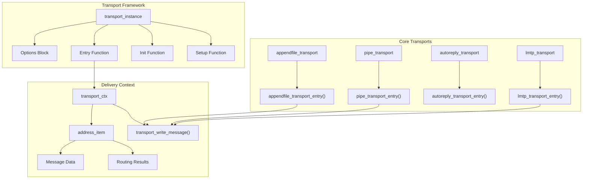

Each transport driver provides:

* An options block defining configurable parameters
* An entry function that performs the actual delivery
* An initialization function for setup and validation
* Optional setup function for privileged operations

Sources: [src/src/transports/appendfile.c L1007-L1018](https://github.com/Exim/exim/blob/29568b25/src/src/transports/appendfile.c#L1007-L1018)

 [src/src/transports/pipe.c L510-L514](https://github.com/Exim/exim/blob/29568b25/src/src/transports/pipe.c#L510-L514)

 [src/src/transports/autoreply.c L263-L266](https://github.com/Exim/exim/blob/29568b25/src/src/transports/autoreply.c#L263-L266)

### Transport Selection and Execution

```mermaid
sequenceDiagram
  participant Router
  participant deliver.c
  participant Transport Driver
  participant transport_write_message()

  Router->>deliver.c: "address_item with transport"
  deliver.c->>Transport Driver: "setup() [privileged]"
  deliver.c->>deliver.c: "Change uid/gid"
  deliver.c->>Transport Driver: "entry() function"
  Transport Driver->>transport_write_message(): "Write message data"
  transport_write_message()->>Transport Driver: "Status/errors"
  Transport Driver->>deliver.c: "Delivery status"
```

The delivery process follows a two-phase approach where setup operations requiring privileges are performed first, followed by the actual delivery under the target user context.

Sources: [src/src/transports/appendfile.c L179-L182](https://github.com/Exim/exim/blob/29568b25/src/src/transports/appendfile.c#L179-L182)

 [src/src/transports/pipe.c L125-L127](https://github.com/Exim/exim/blob/29568b25/src/src/transports/pipe.c#L125-L127)

## File Storage Transport (appendfile)

The `appendfile` transport handles delivery to local files and directories, supporting multiple mailbox formats and comprehensive quota management.

### Mailbox Format Support

| Format | Description | Key Features |
| --- | --- | --- |
| Unix mbox | Traditional single-file format | From-line separation, file locking |
| Maildir | Directory-based format | Atomic delivery, no locking required |
| MBX | University of Washington format | Binary headers, efficient indexing |
| Mailstore | Simple directory format | One file per message |

The transport automatically detects and handles format-specific requirements:

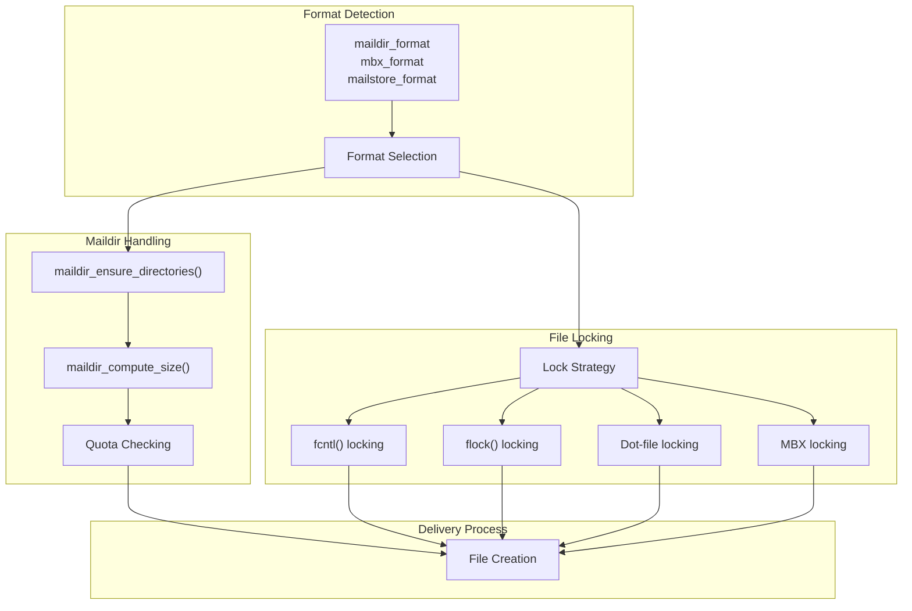

Sources: [src/src/transports/appendfile.c L145-L149](https://github.com/Exim/exim/blob/29568b25/src/src/transports/appendfile.c#L145-L149)

 [src/src/transports/tf_maildir.c L46-L48](https://github.com/Exim/exim/blob/29568b25/src/src/transports/tf_maildir.c#L46-L48)

 [src/src/transports/appendfile.c L824-L903](https://github.com/Exim/exim/blob/29568b25/src/src/transports/appendfile.c#L824-L903)

### Quota Management

The appendfile transport implements sophisticated quota management with multiple enforcement mechanisms:

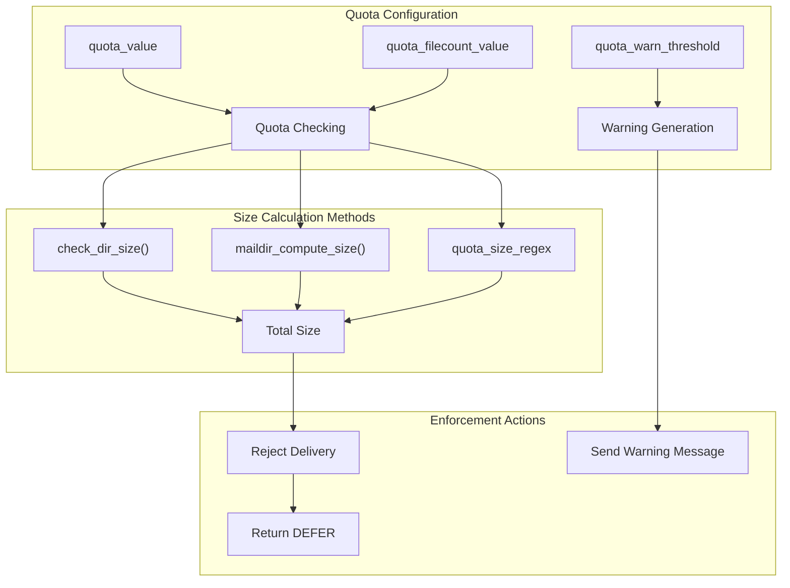

Quota checking supports both size-based and file-count limits, with optional regex-based size extraction from filenames for performance optimization.

Sources: [src/src/transports/appendfile.c L196-L315](https://github.com/Exim/exim/blob/29568b25/src/src/transports/appendfile.c#L196-L315)

 [src/src/transports/tf_maildir.c L352-L568](https://github.com/Exim/exim/blob/29568b25/src/src/transports/tf_maildir.c#L352-L568)

 [src/src/transports/appendfile.c L673-L750](https://github.com/Exim/exim/blob/29568b25/src/src/transports/appendfile.c#L673-L750)

## Command Execution Transport (pipe)

The `pipe` transport executes external commands for message delivery, supporting both shell and direct command execution with comprehensive security controls.

### Command Execution Modes

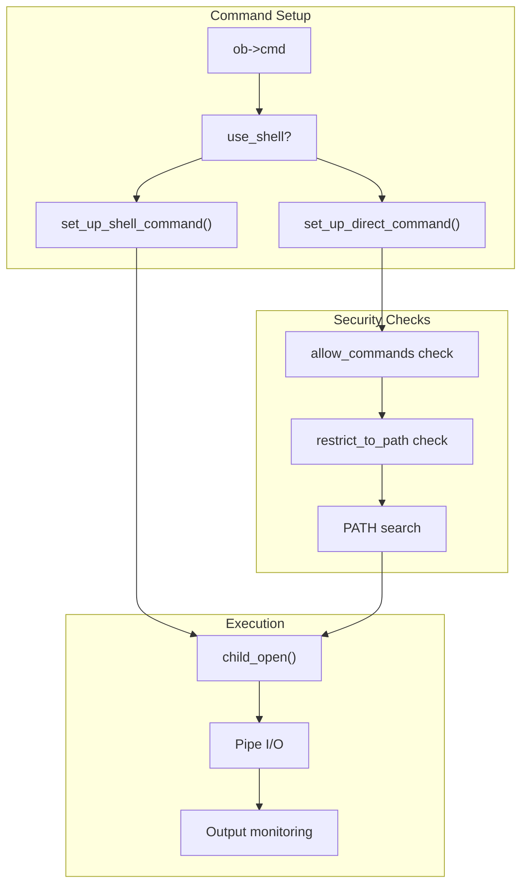

The transport provides two execution modes:

* **Shell mode**: Commands executed via `/bin/sh -c`, supporting shell features like pipes and redirection
* **Direct mode**: Direct execution with argument parsing and security restrictions

Sources: [src/src/transports/pipe.c L296-L397](https://github.com/Exim/exim/blob/29568b25/src/src/transports/pipe.c#L296-L397)

 [src/src/transports/pipe.c L419-L497](https://github.com/Exim/exim/blob/29568b25/src/src/transports/pipe.c#L419-L497)

 [src/src/transports/pipe.c L612-L618](https://github.com/Exim/exim/blob/29568b25/src/src/transports/pipe.c#L612-L618)

### Security and Resource Controls

The pipe transport implements multiple layers of security control:

| Control | Purpose | Configuration |
| --- | --- | --- |
| `allow_commands` | Whitelist permitted commands | List of allowed command names |
| `restrict_to_path` | Prevent absolute paths | Boolean flag |
| `timeout` | Limit execution time | Seconds |
| `max_output` | Limit output size | Bytes |
| `permit_coredump` | Allow core dumps | Boolean flag |

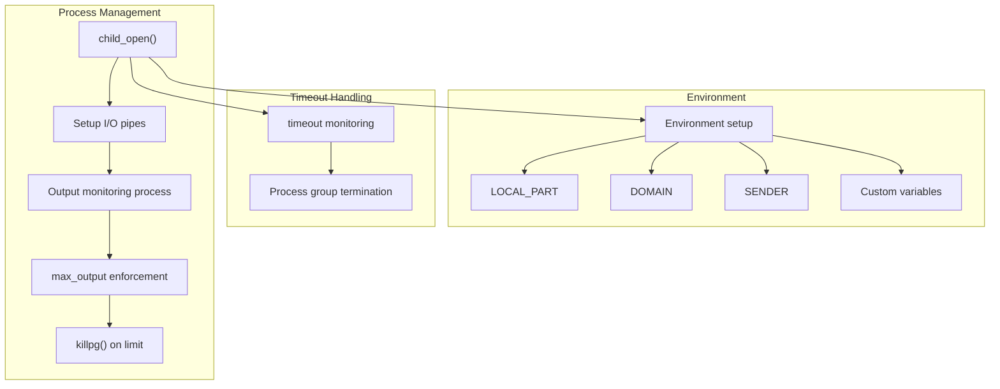

The transport creates a dedicated subprocess for output monitoring to prevent deadlocks and enforce resource limits.

Sources: [src/src/transports/pipe.c L624-L677](https://github.com/Exim/exim/blob/29568b25/src/src/transports/pipe.c#L624-L677)

 [src/src/transports/pipe.c L722-L770](https://github.com/Exim/exim/blob/29568b25/src/src/transports/pipe.c#L722-L770)

 [src/src/transports/pipe.c L125-L166](https://github.com/Exim/exim/blob/29568b25/src/src/transports/pipe.c#L125-L166)

## Autoreply Transport

The `autoreply` transport generates automated responses such as vacation messages, with sophisticated duplicate prevention and content management.

### Response Generation

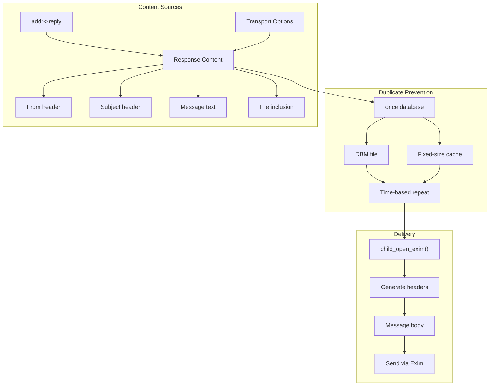

The transport supports both database and file-based tracking of previous responses to prevent mail loops and excessive automation.

Sources: [src/src/transports/autoreply.c L294-L312](https://github.com/Exim/exim/blob/29568b25/src/src/transports/autoreply.c#L294-L312)

 [src/src/transports/autoreply.c L403-L530](https://github.com/Exim/exim/blob/29568b25/src/src/transports/autoreply.c#L403-L530)

 [src/src/transports/autoreply.c L553-L566](https://github.com/Exim/exim/blob/29568b25/src/src/transports/autoreply.c#L553-L566)

### Never Mail and Content Processing

The autoreply transport includes sophisticated recipient filtering and content expansion:

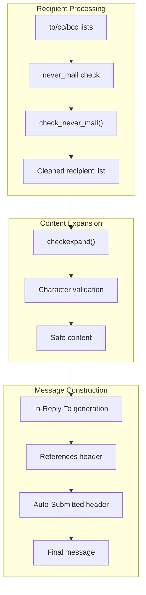

Content validation ensures that expanded strings contain only printable characters, preventing injection attacks and malformed messages.

Sources: [src/src/transports/autoreply.c L173-L250](https://github.com/Exim/exim/blob/29568b25/src/src/transports/autoreply.c#L173-L250)

 [src/src/transports/autoreply.c L126-L154](https://github.com/Exim/exim/blob/29568b25/src/src/transports/autoreply.c#L126-L154)

 [src/src/transports/autoreply.c L584-L594](https://github.com/Exim/exim/blob/29568b25/src/src/transports/autoreply.c#L584-L594)

## LMTP Transport

The `lmtp` transport implements the Local Mail Transfer Protocol for communication with local delivery agents that support the LMTP protocol.

### LMTP Protocol Implementation

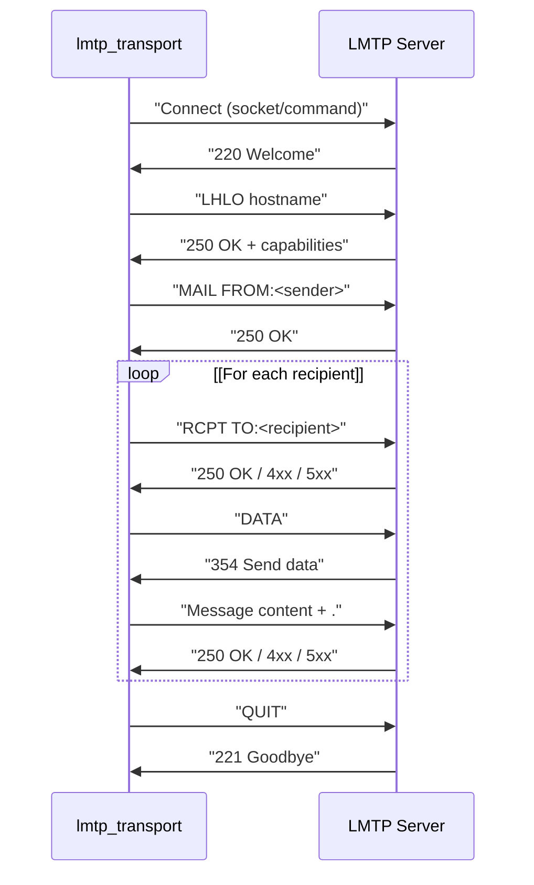

LMTP differs from SMTP in that it returns individual status codes for each recipient after the message data, allowing per-recipient status tracking.

Sources: [src/src/transports/lmtp.c L562-L575](https://github.com/Exim/exim/blob/29568b25/src/src/transports/lmtp.c#L562-L575)

 [src/src/transports/lmtp.c L675-L723](https://github.com/Exim/exim/blob/29568b25/src/src/transports/lmtp.c#L675-L723)

 [src/src/transports/lmtp.c L229-L252](https://github.com/Exim/exim/blob/29568b25/src/src/transports/lmtp.c#L229-L252)

### Connection Methods

The LMTP transport supports two connection methods:

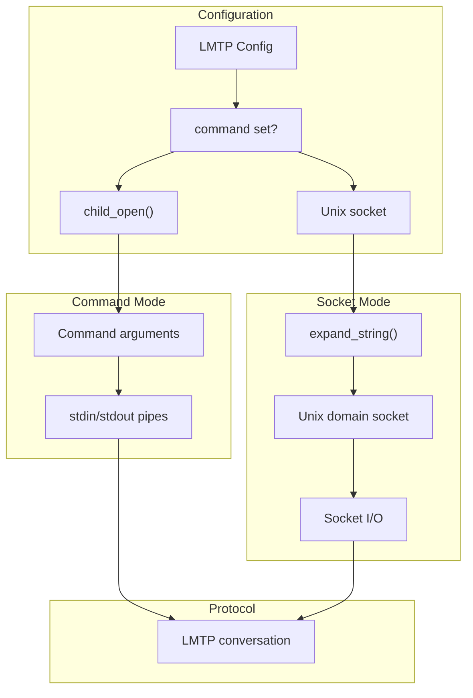

Command mode spawns an external LMTP server process, while socket mode connects to an existing server via Unix domain socket.

Sources: [src/src/transports/lmtp.c L492-L516](https://github.com/Exim/exim/blob/29568b25/src/src/transports/lmtp.c#L492-L516)

 [src/src/transports/lmtp.c L520-L551](https://github.com/Exim/exim/blob/29568b25/src/src/transports/lmtp.c#L520-L551)

 [src/src/transports/lmtp.c L78-L96](https://github.com/Exim/exim/blob/29568b25/src/src/transports/lmtp.c#L78-L96)

## Common Transport Patterns

### Message Writing Interface

All transports use the common `transport_write_message()` function for outputting message content:

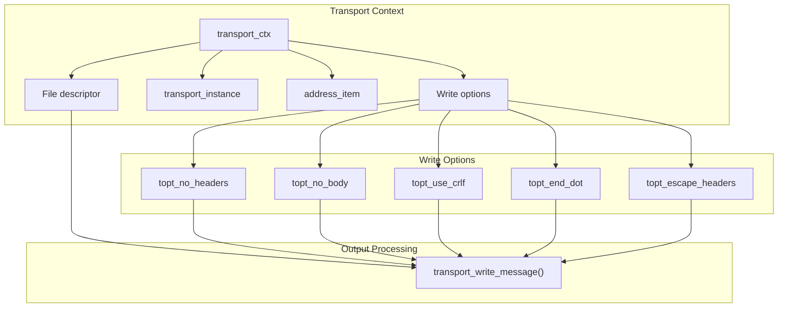

This provides consistent message formatting across all transport types with configurable options for headers, body, line endings, and content escaping.

Sources: [src/src/transports/appendfile.c L485-L492](https://github.com/Exim/exim/blob/29568b25/src/src/transports/appendfile.c#L485-L492)

 [src/src/transports/pipe.c L265-L272](https://github.com/Exim/exim/blob/29568b25/src/src/transports/pipe.c#L265-L272)

 [src/src/transports/lmtp.c L100-L107](https://github.com/Exim/exim/blob/29568b25/src/src/transports/lmtp.c#L100-L107)

### Error Handling and Status Codes

Transports return standardized status codes through the `address_item` structure:

| Status | Meaning | Action |
| --- | --- | --- |
| `OK` | Successful delivery | Message delivered |
| `DEFER` | Temporary failure | Retry later |
| `FAIL` | Permanent failure | Bounce message |
| `PANIC` | System error | Log and bounce |

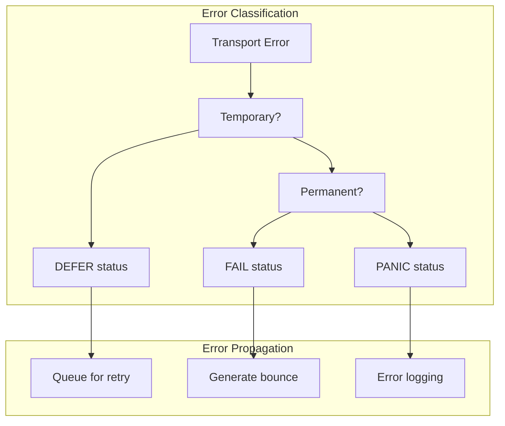

Each transport implements specific error detection and classification logic appropriate to its delivery mechanism.

Sources: [src/src/transports/appendfile.c L1007-L1018](https://github.com/Exim/exim/blob/29568b25/src/src/transports/appendfile.c#L1007-L1018)

 [src/src/transports/pipe.c L1123-L1127](https://github.com/Exim/exim/blob/29568b25/src/src/transports/pipe.c#L1123-L1127)

 [src/src/transports/autoreply.c L286-L287](https://github.com/Exim/exim/blob/29568b25/src/src/transports/autoreply.c#L286-L287)