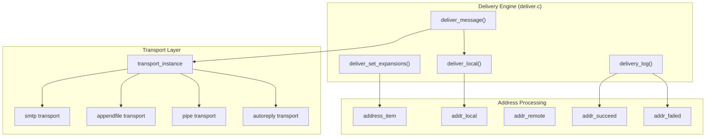
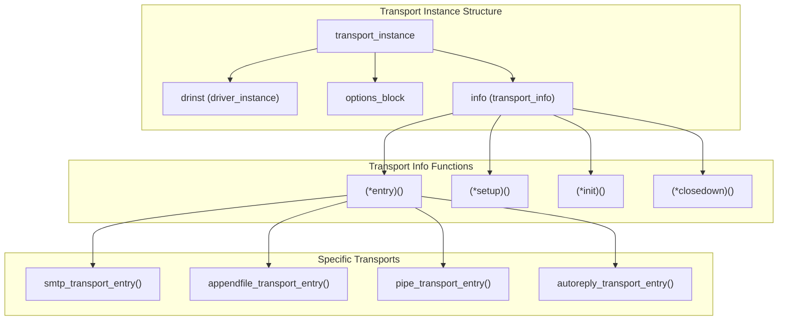
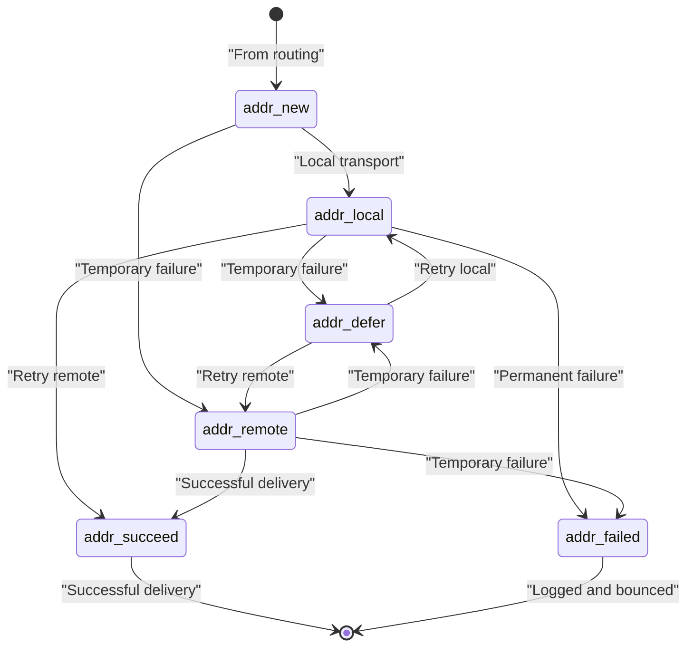
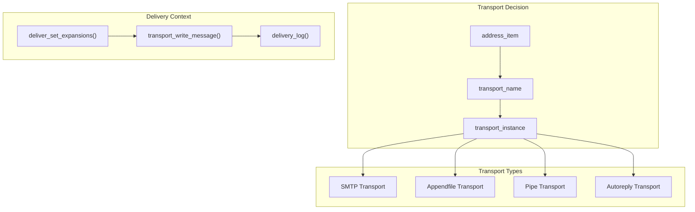
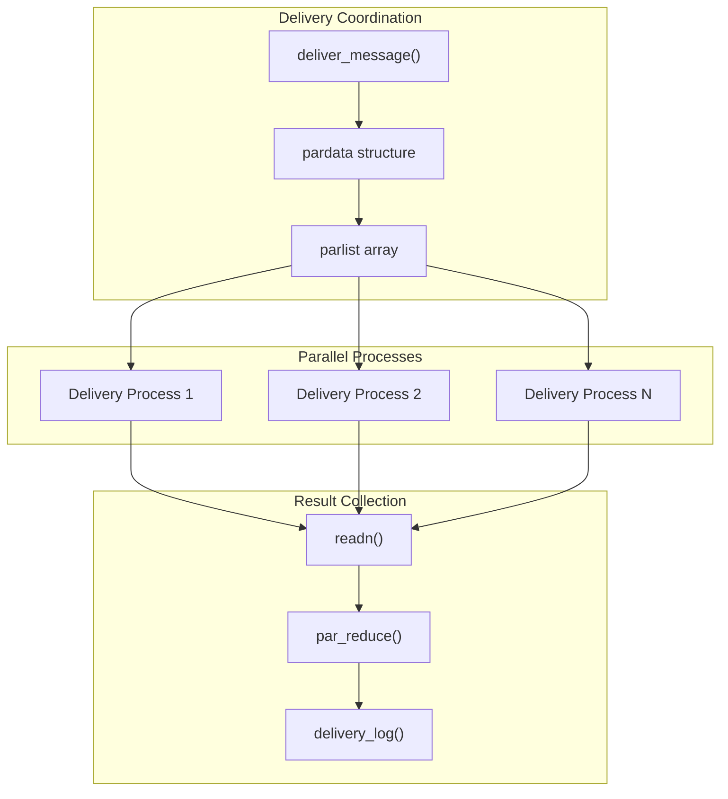
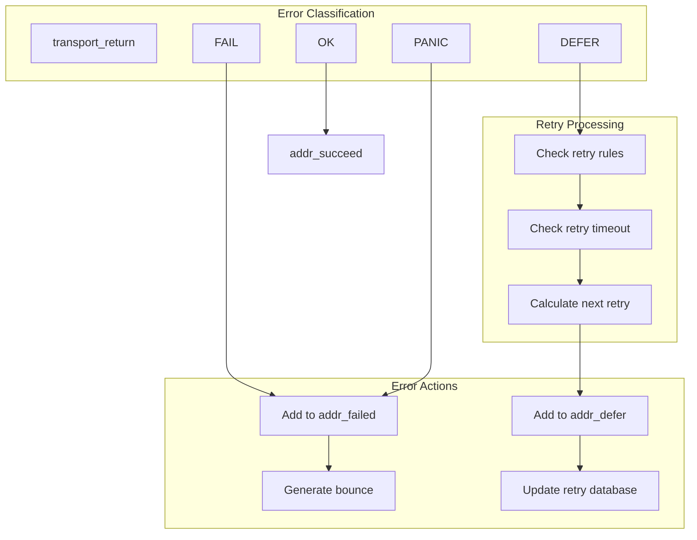

# Transport and Delivery

> **Relevant source files**
> * [doc/doc-docbook/spec.xfpt](https://github.com/Exim/exim/blob/29568b25/doc/doc-docbook/spec.xfpt)
> * [doc/doc-txt/ChangeLog](https://github.com/Exim/exim/blob/29568b25/doc/doc-txt/ChangeLog)
> * [doc/doc-txt/NewStuff](https://github.com/Exim/exim/blob/29568b25/doc/doc-txt/NewStuff)
> * [doc/doc-txt/OptionLists.txt](https://github.com/Exim/exim/blob/29568b25/doc/doc-txt/OptionLists.txt)
> * [src/src/acl.c](https://github.com/Exim/exim/blob/29568b25/src/src/acl.c)
> * [src/src/daemon.c](https://github.com/Exim/exim/blob/29568b25/src/src/daemon.c)
> * [src/src/deliver.c](https://github.com/Exim/exim/blob/29568b25/src/src/deliver.c)
> * [src/src/exim.c](https://github.com/Exim/exim/blob/29568b25/src/src/exim.c)
> * [src/src/expand.c](https://github.com/Exim/exim/blob/29568b25/src/src/expand.c)
> * [src/src/functions.h](https://github.com/Exim/exim/blob/29568b25/src/src/functions.h)
> * [src/src/globals.c](https://github.com/Exim/exim/blob/29568b25/src/src/globals.c)
> * [src/src/globals.h](https://github.com/Exim/exim/blob/29568b25/src/src/globals.h)
> * [src/src/readconf.c](https://github.com/Exim/exim/blob/29568b25/src/src/readconf.c)
> * [src/src/receive.c](https://github.com/Exim/exim/blob/29568b25/src/src/receive.c)
> * [src/src/smtp_in.c](https://github.com/Exim/exim/blob/29568b25/src/src/smtp_in.c)
> * [src/src/structs.h](https://github.com/Exim/exim/blob/29568b25/src/src/structs.h)
> * [src/src/transport.c](https://github.com/Exim/exim/blob/29568b25/src/src/transport.c)
> * [src/src/transports/appendfile.c](https://github.com/Exim/exim/blob/29568b25/src/src/transports/appendfile.c)
> * [src/src/transports/autoreply.c](https://github.com/Exim/exim/blob/29568b25/src/src/transports/autoreply.c)
> * [src/src/transports/lmtp.c](https://github.com/Exim/exim/blob/29568b25/src/src/transports/lmtp.c)
> * [src/src/transports/pipe.c](https://github.com/Exim/exim/blob/29568b25/src/src/transports/pipe.c)
> * [src/src/transports/smtp.c](https://github.com/Exim/exim/blob/29568b25/src/src/transports/smtp.c)
> * [src/src/transports/tf_maildir.c](https://github.com/Exim/exim/blob/29568b25/src/src/transports/tf_maildir.c)
> * [src/src/verify.c](https://github.com/Exim/exim/blob/29568b25/src/src/verify.c)

This document covers the delivery subsystem within Exim's core mail processing pipeline. It focuses on how the delivery engine coordinates message delivery by interfacing with various transport drivers, managing delivery processes, and handling delivery results. For details about specific transport mechanisms (SMTP, file, pipe, etc.), see [Transport Mechanisms](/Exim/exim/6-transport-mechanisms). For information about how messages are routed to determine delivery methods, see [Routing System](/Exim/exim/2.2-routing-system).

## Delivery Engine Overview

The delivery engine, primarily implemented in `deliver.c`, serves as the central coordinator for message delivery after routing has determined where messages should go. It manages the handoff from the routing system to transport drivers and oversees the entire delivery process.



Sources: [src/src/deliver.c L1-L4000](https://github.com/Exim/exim/blob/29568b25/src/src/deliver.c#L1-L4000)

 [src/src/transport.c L1-L100](https://github.com/Exim/exim/blob/29568b25/src/src/transport.c#L1-L100)

 [src/src/structs.h L1000-L1200](https://github.com/Exim/exim/blob/29568b25/src/src/structs.h#L1000-L1200)

## Transport Interface Architecture

The delivery engine interfaces with transport drivers through a standardized transport interface. Each transport implements the `transport_instance` structure and provides specific delivery functions.



Sources: [src/src/structs.h L800-L900](https://github.com/Exim/exim/blob/29568b25/src/src/structs.h#L800-L900)

 [src/src/transport.c L50-L150](https://github.com/Exim/exim/blob/29568b25/src/src/transport.c#L50-L150)

 [src/src/transports/smtp.c L160-L170](https://github.com/Exim/exim/blob/29568b25/src/src/transports/smtp.c#L160-L170)

## Message Delivery Process Flow

The delivery process follows a well-defined sequence from message acceptance through transport invocation to final disposition logging.

```mermaid
sequenceDiagram
  participant Routing System
  participant deliver_message()
  participant Address Lists
  participant Transport Driver
  participant delivery_log()

  Routing System->>deliver_message(): "Routed addresses"
  deliver_message()->>deliver_message(): "Split addresses by transport"
  deliver_message()->>Address Lists: "Organize into addr_local, addr_remote"
  loop ["For each transport"]
    deliver_message()->>deliver_message(): "deliver_set_expansions()"
    deliver_message()->>Transport Driver: "transport->entry()"
    Transport Driver->>Transport Driver: "Attempt delivery"
    Transport Driver->>deliver_message(): "Return delivery status"
    deliver_message()->>Address Lists: "Update addr_succeed/addr_failed"
  end
  deliver_message()->>delivery_log(): "delivery_log() for results"
  delivery_log()->>delivery_log(): "Write to main log and message log"
```

Sources: [src/src/deliver.c L7000-L8000](https://github.com/Exim/exim/blob/29568b25/src/src/deliver.c#L7000-L8000)

 [src/src/deliver.c L1000-L1200](https://github.com/Exim/exim/blob/29568b25/src/src/deliver.c#L1000-L1200)

## Address Processing and State Management

The delivery engine maintains several address lists to track delivery progress and manage address states throughout the delivery process.

| Address List | Purpose | Location in Code |
| --- | --- | --- |
| `addr_local` | Addresses for local delivery | [src/src/deliver.c L66](https://github.com/Exim/exim/blob/29568b25/src/src/deliver.c#L66-L66) |
| `addr_remote` | Addresses for remote delivery | [src/src/deliver.c L68](https://github.com/Exim/exim/blob/29568b25/src/src/deliver.c#L68-L68) |
| `addr_defer` | Addresses deferred for retry | [src/src/deliver.c L63](https://github.com/Exim/exim/blob/29568b25/src/src/deliver.c#L63-L63) |
| `addr_failed` | Addresses that failed permanently | [src/src/deliver.c L64](https://github.com/Exim/exim/blob/29568b25/src/src/deliver.c#L64-L64) |
| `addr_succeed` | Successfully delivered addresses | [src/src/deliver.c L70](https://github.com/Exim/exim/blob/29568b25/src/src/deliver.c#L70-L70) |



Sources: [src/src/deliver.c L60-L80](https://github.com/Exim/exim/blob/29568b25/src/src/deliver.c#L60-L80)

 [src/src/deliver.c L7500-L7600](https://github.com/Exim/exim/blob/29568b25/src/src/deliver.c#L7500-L7600)

## Transport Selection and Invocation

The delivery engine determines which transport to use based on the routing results and invokes the appropriate transport driver through the standardized interface.



The `deliver_set_expansions()` function sets up expansion variables specific to each address before transport invocation:

| Variable Set | Purpose | Code Reference |
| --- | --- | --- |
| `deliver_host*` | Target host information | [src/src/deliver.c L186-L196](https://github.com/Exim/exim/blob/29568b25/src/src/deliver.c#L186-L196) |
| `deliver_domain` | Destination domain | [src/src/deliver.c L206](https://github.com/Exim/exim/blob/29568b25/src/src/deliver.c#L206-L206) |
| `deliver_localpart*` | Local part and affixes | [src/src/deliver.c L222-L226](https://github.com/Exim/exim/blob/29568b25/src/src/deliver.c#L222-L226) |
| `deliver_address_data` | Address-specific data | [src/src/deliver.c L199](https://github.com/Exim/exim/blob/29568b25/src/src/deliver.c#L199-L199) |

Sources: [src/src/deliver.c L172-L250](https://github.com/Exim/exim/blob/29568b25/src/src/deliver.c#L172-L250)

 [src/src/transport.c L1000-L1100](https://github.com/Exim/exim/blob/29568b25/src/src/transport.c#L1000-L1100)

## Parallel Delivery Processing

For efficiency, the delivery engine can process multiple deliveries in parallel, particularly for remote deliveries where network latency is a factor.



The `pardata` structure tracks parallel delivery processes:

* `pid`: Process ID of the delivery subprocess
* `fd`: File descriptor for communication with subprocess
* `addrlist`: Chain of addresses being processed
* `transport_count`: Number of bytes transferred
* `done`: Whether the process has completed

Sources: [src/src/deliver.c L19-L31](https://github.com/Exim/exim/blob/29568b25/src/src/deliver.c#L19-L31)

 [src/src/deliver.c L108-L126](https://github.com/Exim/exim/blob/29568b25/src/src/deliver.c#L108-L126)

## Error Handling and Retry Logic

The delivery engine implements comprehensive error handling and retry mechanisms to deal with temporary failures and ensure reliable message delivery.



Sources: [src/src/deliver.c L8000-L8500](https://github.com/Exim/exim/blob/29568b25/src/src/deliver.c#L8000-L8500)

 [src/src/deliver.c L9000-L9500](https://github.com/Exim/exim/blob/29568b25/src/src/deliver.c#L9000-L9500)